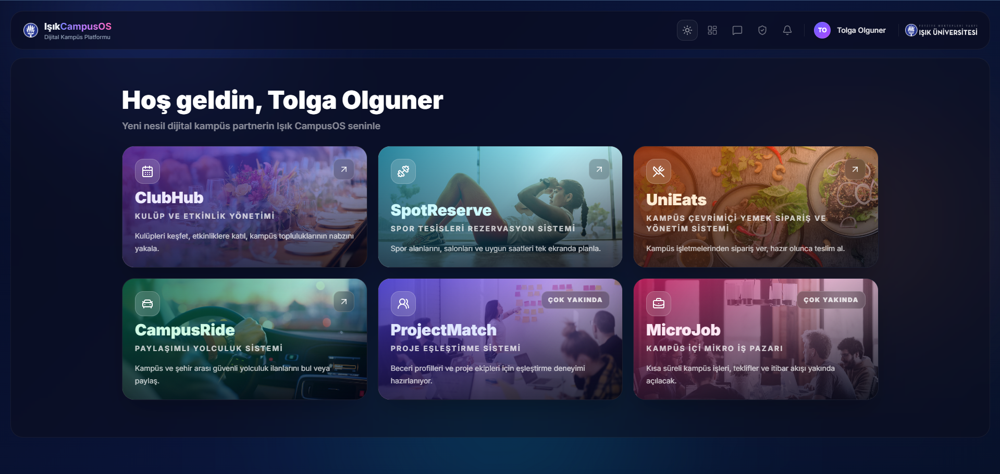
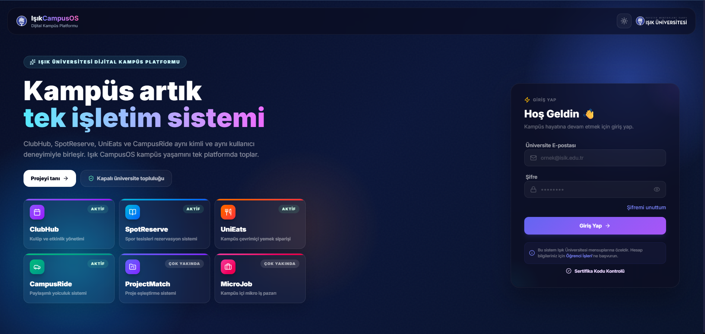
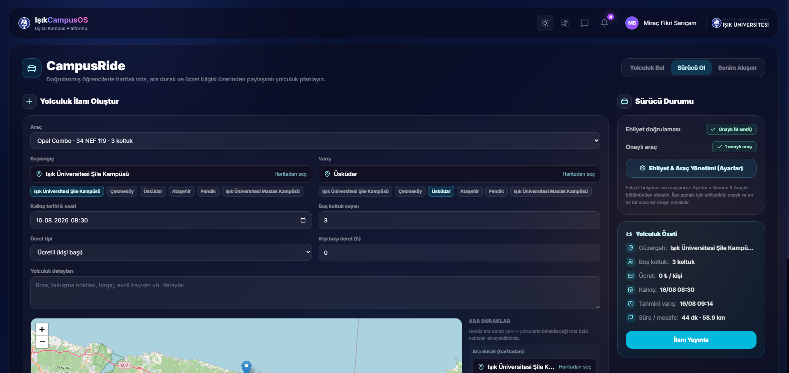
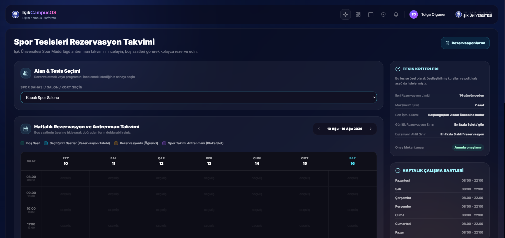
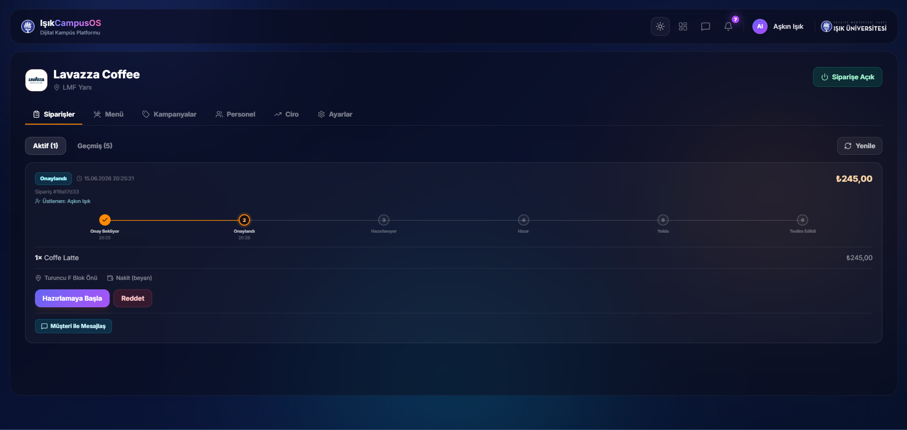
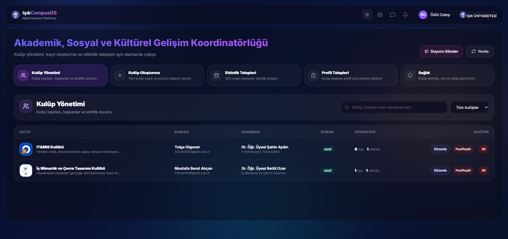
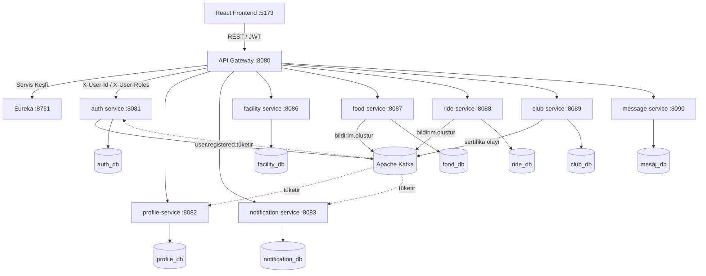

<div align="center">

# Işık CampusOS

**Kampüs yaşamının dağınık süreçlerini tek kimlik ve tek arayüz altında birleştiren, mikroservis tabanlı bütünleşik kampüs platformu.**

Kulüp ve etkinlik yönetimi · Spor tesisi rezervasyonu · Kampüs içi yemek siparişi · Paylaşımlı yolculuk
— hepsi ortak bir kimlik, bildirim ve mesajlaşma omurgası üzerinde.


</div>



---

## Problem

Üniversitelerde akademik süreçler için kurumsal otomasyon sistemleri bulunurken, öğrencinin **ders dışı** sosyal ve pratik ihtiyaçları dağınık kanallara bırakılmıştır: kulüp duyuruları sosyal medyada, tesis rezervasyonu e-posta trafiğinde, yemek siparişi düzensiz mesajlaşma gruplarında, ulaşım koordinasyonu ise tamamen kurum dışı platformlarda yürür.

Bu dağınıklık her ihtiyaç için ayrı bir arayüz, ayrı bir hesap ve ayrı bir güven değerlendirmesi gerektirir.

## Çözüm

Işık CampusOS, bu süreçleri **yalnızca doğrulanmış üniversite üyelerine açık, kapalı bir ekosistemde** birleştirir. Tek oturumla erişilen, ortak tasarım diline sahip ve modüler biçimde genişleyebilen bir platform.

## Öne çıkan teknik özellikler

| | |
|---|---|
| 🔐 **Merkezî kimlik doğrulama** | JWT doğrulaması tek noktada — API Gateway'de. Servisler kimlik mantığını tekrarlamaz; doğrulanmış kullanıcı ve roller güvenilir HTTP başlıklarıyla iletilir. |
| ⚡ **Olay güdümlü entegrasyon** | Servisler birbirini senkron çağırmaz. `user.registered`, `bildirim.olustur` gibi Kafka olaylarıyla gevşek bağlı çalışır; bir servisin geçici erişilemezliği diğerini durdurmaz. |
| 🔴 **Gerçek zamanlı bildirim** | Sunucu gönderimli olaylar (SSE) ile anlık bildirim ve mesaj akışı; okundu/okunmadı durumu tek serviste merkezîleşir. |
| 🗄️ **Servis başına veri tabanı** | Her servisin kendi PostgreSQL şeması var. Şema değişiklikleri Flyway migration'larıyla sürümlenir; uygulama açılışta yalnızca doğrulama yapar (`ddl-auto: validate`). |
| 📅 **Çakışmasız rezervasyon** | Tesis rezervasyonu iki aşamalı doğrulanır: önce tesis politikası (ön bildirim, azami süre), sonra aynı kaynak/zaman aralığında etkin rezervasyon kontrolü. Yarışmalı işlemler tekillik kısıtı ve transaction sınırlarıyla korunur. |
| 📱 **QR check-in ve sertifika** | Etkinlik katılımı QR kod ile doğrulanır, katılım sertifikası otomatik üretilip doğrulanabilir bağlantıyla paylaşılır. |
| 🚗 **Hibrit konum eşleştirme** | Paylaşımlı yolculukta yoğun güzergâhlar için önceden tanımlı toplanma noktaları, seyrek güzergâhlar için serbest konum girişi. Eşleştirmede sürücünün rota sapması tolerans sınırında tutulur. |
| 🛡️ **Kapalı topluluk güveni** | Akranlar arası modüllerde araç/ehliyet doğrulaması, çift yönlü puanlama ve şikâyet mekanizması. |

## Ekran görüntüleri

<table>
<tr>
<td width="50%"><br><sub><b>Giriş ve kimlik doğrulama</b></sub></td>
<td width="50%"><br><sub><b>CampusRide — paylaşımlı yolculuk</b></sub></td>
</tr>
<tr>
<td><br><sub><b>Tesis rezervasyonu</b></sub></td>
<td><br><sub><b>İşletme yönetim paneli</b></sub></td>
</tr>
<tr>
<td colspan="2"><br><sub><b>SKS yönetim paneli — kulüp ve etkinlik onay akışları</b></sub></td>
</tr>
</table>

## Mimari



- Her domain bağımsız bir Spring Boot servisi olarak çalışır ve kendi veri tabanına sahiptir.
- Tüm trafik **API Gateway** (Spring Cloud Gateway) üzerinden akar; JWT doğrulaması burada merkezîleşir.
- Servisler arası asenkron iletişim **Apache Kafka** ile sağlanır.
- Servis kayıt ve keşfi **Eureka**, dağıtık izleme **Zipkin** ile yönetilir.
- Tüm servisler tek depoda (**monorepo**) `services/` altında tutulur, **Docker Compose** ile ayağa kalkar.

### Servis kataloğu

| Servis | Port | Sorumluluk |
|--------|------|------------|
| `eureka-server` | 8761 | Servis kayıt ve keşfi |
| `api-gateway` | 8080 | Yönlendirme, merkezî JWT doğrulama, CORS |
| `auth-service` | 8081 | Kimlik, JWT üretimi, e-posta doğrulama, kullanıcı yönetimi |
| `profile-service` | 8082 | Profil yönetimi, beceri etiketleri |
| `notification-service` | 8083 | Platform geneli in-app bildirim, SSE akışı, duyuru |
| `facility-service` | 8086 | Tesis ve kaynak rezervasyonu, çakışma kontrolü, yoklama |
| `food-service` | 8087 | Satıcı, menü, kampanya, sipariş ve işletme yönetimi |
| `ride-service` | 8088 | Paylaşımlı yolculuk ilanı, eşleştirme, doğrulama, puanlama |
| `club-service` | 8089 | Kulüp, etkinlik, RSVP, QR check-in, sertifika, duyuru |
| `message-service` | 8090 | Bağlam temelli konuşma ve mesajlaşma, SSE akışı |

`common-security` bir servis değil, servisler arasında paylaşılan JWT/yetki kütüphanesidir.

### Teknoloji yığını

| Katman | Teknoloji |
|--------|-----------|
| Arka uç | Java 21, Spring Boot 3.2, Spring Security |
| API katmanı | Spring Cloud Gateway |
| Servis keşfi | Spring Cloud Netflix Eureka |
| Mesajlaşma | Apache Kafka |
| Veri | PostgreSQL (servis başına) + Flyway |
| Ön yüz | React 19, TypeScript, Vite, Tailwind CSS, Zustand |
| İzleme | Zipkin |
| Dağıtım | Docker & Docker Compose |

## Kurulum ve çalıştırma

**Gereksinimler:** Docker Desktop, JDK 21, Node.js 20+

### 1. Ortam değişkenlerini hazırla

`.env` dosyası **zorunludur** — `JWT_SECRET` ve `POSTGRES_PASSWORD` tanımlı değilse servisler bilinçli olarak başlamaz (fail-fast).

```bash
cp .env.example .env
```

Ardından `.env` içindeki değerleri doldur:

```bash
openssl rand -hex 32      # JWT_SECRET icin
openssl rand -base64 24   # POSTGRES_PASSWORD icin
```

> `SPRING_DATASOURCE_PASSWORD` ile `POSTGRES_PASSWORD` **aynı** değer olmalıdır.

### 2. Derle ve başlat

```powershell
.\mvnw.cmd clean package -DskipTests   # servis JAR'larini uretir (~3-4 dk)
docker compose up -d                    # tum sistem
```

Uygulama birkaç dakika içinde **http://localhost:8080** adresinde açılır.

| Arayüz | Adres |
|--------|-------|
| Uygulama | http://localhost:8080 |
| Eureka paneli | http://localhost:8761 |
| Zipkin (izleme) | http://localhost:9411 |
| Mailpit (e-posta yakalayıcı) | http://localhost:8025 |

Yalnızca altyapıyı (PostgreSQL, Kafka, Zipkin, Mailpit) ayağa kaldırmak için:

```bash
docker compose -f infra/docker-compose.infra.yml up -d
```

### 3. Giriş

Kurumsal roller (yönetici, öğrenci işleri, SKS, tesis yönetimi, işletme) `auth-service` migration'larıyla otomatik oluşturulur. **Bu hesapların parolaları güvenlik gerekçesiyle depoda yayımlanmaz.** Kendi kurulumunda giriş yapmak için `auth_db.kullanicilar` tablosundaki ilgili kaydın `sifre` alanına kendi BCrypt hash'ini yazman yeterlidir.

Öğrenci hesapları migration ile gelmez; Öğrenci İşleri rolüyle giriş yapıp panelden oluşturulur. Yeni kullanıcıların e-posta doğrulama kodları geliştirme ortamında Mailpit'e düşer.

<details>
<summary>Gerçek Gmail SMTP ile e-posta gönderimi</summary>

Doğrulama ve şifre sıfırlama kodlarını gerçek bir Gmail hesabı üzerinden göndermek için `.env.gmail.example` dosyasındaki ayarları `.env` dosyana ekle ve `MAIL_PASSWORD` değerini bir Gmail **App Password** ile doldur. `MAIL_ENABLED=false` yaparsan e-posta gönderimi tamamen kapanır.

</details>

## Platform modülleri

**Gerçekleştirilen:**

- **Smart Event Engine** — kulüp yaşam döngüsü, SKS onay akışları, etkinlik durum makinesi, RSVP ve bekleme listesi, QR check-in, sertifika üretimi
- **Smart Facility Booking** — tesis/kaynak yönetimi, uygunluk kuralları, çakışmasız rezervasyon, yoklama
- **Campus Food Hub** — satıcı, menü, kategori, kampanya, sipariş durum makinesi, işletme paneli ve ciro takibi
- **CampusRide** — planlı paylaşımlı yolculuk, hibrit konum modeli, araç/ehliyet doğrulama, çift yönlü puanlama

Bu modüller ortak bir **bildirim** ve **bağlam temelli mesajlaşma** altyapısıyla desteklenir.

**Tasarım düzeyinde ele alınan (gerçekleştirimi gelecek çalışma):**

- **ProjectMatch** — etiket tabanlı proje ekibi eşleştirme
- **Campus MicroJob** — kampüs içi mikro iş pazarı

Bu iki modülün tasarımı bitirme tezinin 6.3 (Gelecek Çalışmalar) bölümünde ele alınmıştır; kod tabanında karşılıkları yoktur.

## Dokümantasyon

Tüm dokümanların dizini: **[docs/00-INDEKS.md](docs/00-INDEKS.md)**

| Doküman | İçerik |
|---------|--------|
| [Genel Bakış ve Vizyon](docs/proje/01-genel-bakis-ve-vizyon.md) | Proje tanımı, modül durum tablosu, hedef kullanıcılar |
| [Mimari](docs/proje/02-mimari.md) | Mikroservis mimarisi, iletişim desenleri, gateway rotaları |
| [Veritabanı Tasarımı](docs/proje/03-veritabani-tasarimi.md) | Servis başına şema, entity'ler, migration disiplini |
| [API Sözleşmesi](docs/proje/04-api-sozlesmesi.md) | Gerçek uç noktalar, istek/yanıt biçimleri |
| [Roller ve Yetkiler](docs/proje/05-roller-ve-yetkiler.md) | Rol modeli, yetki matrisi, iş kuralları |
| [Kullanıcı Akışları](docs/proje/06-kullanici-akislari.md) | Kayıt, kulüp/etkinlik, tesis, bildirim akışları |
| [Çalıştırma Rehberi](docs/proje/07-calistirma-rehberi.md) | Ayrıntılı yerel kurulum |
| [Yol Haritası ve Durum](docs/proje/08-yol-haritasi-ve-durum.md) | Mevcut durum, teknik borçlar, mimari karar kayıtları (ADR) |

**Akademik çıktılar:** [Bitirme Tezi (Word)](docs/tez/IsikCampusOS_Tez.docx) · [Proje Afişi (PDF)](docs/afis.pdf)

## Proje durumu

On servisin tamamı çalışır durumdadır ve API Gateway üzerinden yönlendirilir. Frontend giriş, rol bazlı paneller, kulüp/etkinlik, tesis, yemek, CampusRide, bildirim ve mesajlaşma ekranlarını içerir.

Frontend üretim derlemesi rota bazlı kod bölünmesi kullanır: her sayfa `React.lazy` ile kendi chunk'ına ayrılır, `xlsx` gibi ağır kütüphaneler yalnızca kullanıldıkları anda indirilir. İlk açılışta inen paket **1.66 MB'tan ~445 kB'a** (gzip ~141 kB) düşmüştür.

**Bilinen teknik borçlar:** kritik iş kuralları için birim test kapsamı sınırlıdır (8 serviste 15 test sınıfı); frontend tarafında ESLint henüz temiz değildir (`react-hooks` ve `no-explicit-any` kaynaklı uyarılar). Ayrıntılar [yol haritası dokümanında](docs/proje/08-yol-haritasi-ve-durum.md).

## Kapsam dışı ve gelecek çalışmalar

Aşağıdaki başlıklar bitirme tezi kapsamında **bilinçli olarak** kapsam dışı bırakılmıştır (bkz. tez Bölüm 6.2 ve 6.3):

- **ProjectMatch ve MicroJob servisleri** — tasarımı yapıldı, gerçekleştirimi yapılmadı
- **Yerel (native) mobil uygulama** — platform web tabanlıdır
- **Gerçek ödeme ağ geçidi entegrasyonu** — ödeme akışları uygulama içi durum takibiyle sınırlıdır
- **SIS/LMS canlı veri entegrasyonu** ve fiziksel donanım/IoT bağlantıları
- **Saha çalışması ve ampirik değerlendirme** — değerlendirme işlevsel doğrulama ve senaryo temelli inceleme ile sınırlıdır
- **Üretim ölçeği operasyonel olgunluk** — yük testi, gözlemlenebilirlik, çoklu kampüs (multi-tenant) desteği

Moderasyon ve analitik yetenekleri de ileride ayrı servisler olarak değerlendirilebilir.

## Lisans

Kaynak kod ve teknik dokümantasyon [MIT Lisansı](LICENSE) ile yayımlanmıştır.

Bitirme tezi (`docs/tez/IsikCampusOS_Tez.docx`) ve proje afişi (`docs/afis.pdf`) bu lisansın kapsamı dışındadır; bu akademik çalışmaların tüm hakları saklıdır.

---

<div align="center">
<sub>Işık Üniversitesi · Yönetim Bilişim Sistemleri · Lisans Bitirme Projesi · 2026</sub>
</div>
