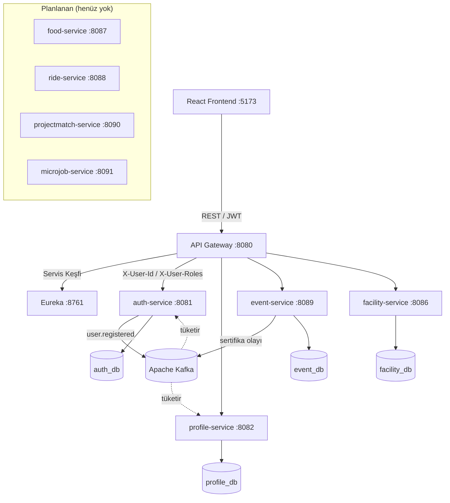

# 02 — Sistem Mimarisi

## 1. Genel Yaklaşım

IsikCampusOS, **mikroservis mimarisi** ile inşa edilmiştir. Her domain bağımsız bir Spring Boot servisi olarak çalışır; servisler bir **API Gateway** arkasında konumlanır ve istemci hiçbir servise doğrudan erişemez. Tüm proje tek bir Git deposunda (**monorepo**) `services/` dizini altında yönetilir.

> **Not — kod gerçekliği:** Kod tabanı Türkçeleştirilmiştir. Paketler `com.isik.kampusos.*` altındadır ve sınıf adları Türkçedir (ör. `KimlikServisi`, `KulupDeposu`, `EtkinlikDenetleyicisi`, `TesisRezervasyonu`). Eski İngilizce paket adı `com.isik.campusos` artık kullanılmamaktadır.

## 2. Servis Kataloğu

### 2.1. Çalışan Servisler (kodlandı)

| Servis | Port | Sorumluluk | Kod paketi |
|--------|------|------------|-----------|
| `eureka-server` | 8761 | Servis kayıt ve keşif | `com.isik.campusos.eureka` |
| `api-gateway` | 8080 | Yönlendirme, CORS, merkezi JWT doğrulama | `com.isik.kampusos.gecit` |
| `auth-service` | 8081 | Kimlik, JWT, e-posta doğrulama, öğrenci yönetimi, sertifika doğrulama | `com.isik.kampusos.kimlik` |
| `profile-service` | 8082 | Profil kayıtları, profil değişiklik onayı | `com.isik.kampusos.profil` |
| `event-service` | 8089 | Kulüp, etkinlik, RSVP, check-in, **bildirim**, akademik kadro, denetim günlüğü | `com.isik.kampusos.etkinlik` |
| `facility-service` | 8086 | Tesis, kaynak, rezervasyon, uygunluk, check-in | `com.isik.kampusos.tesis` |

**Not:** Bildirim (notification) işlevi ayrı bir servis değildir; `event-service` içinde gömülü olarak (in-app, `event_db`) çalışmaktadır. Bu, bilinçli bir mimari karardır: bildirimin bugün tek tüketicisi event-service olduğu için ayrı servise çıkarılmamış; ikinci bir modül bildirim üretmeye başladığında olay güdümlü bağımsız `notification-service` olarak ayrılması planlanmıştır (bkz. [08-yol-haritasi-ve-durum.md](08-yol-haritasi-ve-durum.md), ADR-001).

### 2.2. Planlanan Servisler (henüz kodlanmadı)

| Servis | Port | Sorumluluk |
|--------|------|------------|
| `food-service` | 8087 | Satıcı, menü, sipariş yönetimi |
| `ride-service` | 8088 | Paylaşımlı yolculuk ilanı ve eşleştirme |
| `projectmatch-service` | 8090 | Beceri profili, proje ilanı, ekip eşleştirme |
| `microjob-service` | 8091 | İş ilanı, teklif, anlaşma |

> İleride bildirim, moderasyon ve analitik işlevleri büyüdükçe ayrı servislere (`notification-service`, `moderation-service`, `analytics-service`) çıkarılabilir. Şu an böyle ayrı servisler **yoktur**.

## 3. Altyapı Bileşenleri

Docker Compose ile yerel ortamda ayağa kaldırılır (bkz. `docker-compose.yml` ve `infra/docker-compose.infra.yml`):

| Bileşen | Port | Rol |
|---------|------|-----|
| PostgreSQL 15 | 5433→5432 | Servis bazlı ilişkisel veritabanı |
| Apache Kafka | 9092 | Asenkron olay iletişimi |
| Zookeeper | 2181 | Kafka koordinasyonu |
| Redis | 6379 | Önbellek / rate limiting (opsiyonel) |
| Zipkin | 9411 | Dağıtık izleme (distributed tracing) |
| Mailpit | 1025 / 8025 | Yerel e-posta test ortamı |

## 4. İstemci (Frontend)

| Teknoloji | Amaç |
|-----------|------|
| React 19 + TypeScript | Kullanıcı arayüzü |
| Vite | Geliştirme ve build |
| React Router | Sayfa yönlendirme, korumalı rotalar |
| Zustand | İstemci tarafı durum yönetimi |
| Axios | REST çağrıları (token interceptor ile) |
| Tailwind CSS | Stil sistemi |
| Framer Motion / Lucide | Animasyon / ikon |

Frontend, tüm istekleri API Gateway (`:8080`) üzerinden yapacak biçimde tasarlanmıştır.

## 5. İletişim Modeli

### 5.1. Senkron (REST, API Gateway üzerinden)

```
İstemci (React) → API Gateway (:8080) → Downstream Servis
```

1. İstemci, JWT'yi `Authorization: Bearer <token>` başlığıyla Gateway'e gönderir.
2. Gateway, korumalı rotalarda `KimlikDogrulama` filtresiyle token'ı doğrular.
3. Token geçerliyse, kullanıcı kimliği ve rolleri çözülerek downstream servise `X-User-Id` ve `X-User-Roles` başlıkları olarak eklenir.
4. Downstream servis, veritabanı sorgusu yapmadan bu başlıkları okuyarak rol bazlı yetkilendirmeyi gerçekleştirir.

Servis keşfi **Eureka** ile yapılır; servisler birbirini IP yerine servis adıyla bulur.

### 5.2. Asenkron (Kafka)

Kritik domain olayları Kafka topic'lerine yayılır ve ilgili servisler tüketir. Kodda fiilen kullanılan başlıca akışlar:

- `user.registered` → `auth-service` (üretir) → `profile-service` (tüketir, otomatik profil oluşturur)
- Sertifika oluşturma olayı → `event-service` (üretir) → `auth-service` (tüketir, sertifika PDF/teslimat)

> Mimari dokümanlardaki diğer olay adları (`booking.created`, `order.placed`, `ride.match.created` vb.) **hedef tasarımdır**; ilgili modüller kodlandığında devreye girecektir.

## 6. Gateway Yönlendirme Tablosu (gerçek)

`api-gateway/src/main/resources/application.yml` içindeki güncel rotalar:

| Yol (path) | Hedef servis | Auth filtresi |
|------------|--------------|---------------|
| `/api/v1/kimlik/**` | auth-service | Hayır (login/doğrulama public) |
| `/api/v1/ogrenciler/**` | auth-service | Evet |
| `/api/v1/kullanicilar/**` | auth-service | Evet |
| `/api/v1/sertifikalar/**` | auth-service | Hayır (sertifika doğrulama public) |
| `/api/v1/profiller/**` | profile-service | Evet |
| `/api/v1/etkinlikler/**` | event-service | Evet |
| `/api/v1/kulupler/**` | event-service | Evet |
| `/api/v1/bildirimler/**` | event-service | Evet |
| `/api/v1/yonetim/**` | event-service | Evet |
| `/api/v1/akademik-kadro/**` | event-service | Evet |
| `/api/v1/tesisler/**` | facility-service | Evet |
| `/api/v1/tesis-kaynaklari/**` | facility-service | Evet |
| `/api/v1/tesis-yonetim/**` | facility-service | Evet |
| `/**` | frontend | — |

## 7. Mimari Şema



## 8. Güvenlik Mimarisi

- **Kimlik doğrulama:** auth-service, üniversite e-postası + şifre ile giriş; bcrypt parola, imzalı JWT üretimi.
- **Merkezi doğrulama:** API Gateway, korumalı rotalarda JWT imza doğrulaması yapar.
- **Rol bazlı erişim (RBAC):** Roller token içinde taşınır; servisler `X-User-Roles` üzerinden kontrol eder.
- **Domain bazlı yetki:** Her servis kendi kaynakları üzerinde sahiplik (owner) kontrolü uygular (ör. kulüp başkanı yalnızca kendi kulübünü yönetir).
- **Soft-delete + denetim:** Kritik tablolarda mantıksal silme; kritik aksiyonlar denetim günlüğüne (`DenetimGunlugu`) yazılır.

> **Bilinen teknik borç:** JWT secret değeri hâlâ `application.yml` ve `docker-compose.yml` içinde varsayılan değere sahip; üretim öncesi yalnızca environment variable üzerinden okunmalıdır (bkz. [08-yol-haritasi-ve-durum.md](08-yol-haritasi-ve-durum.md)).
