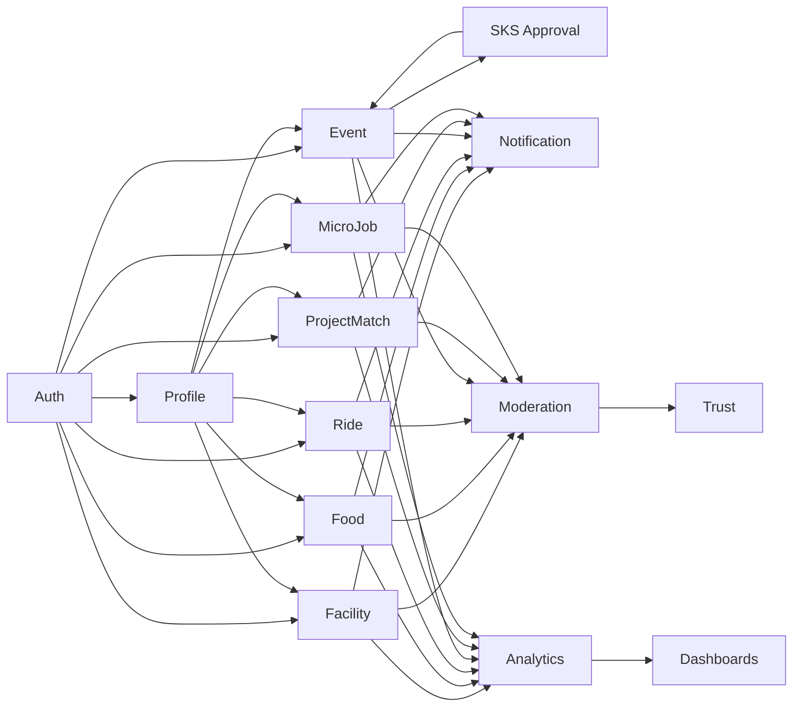

# IsikCampusOS Sistem Blueprint

## 1. Amac ve Vizyon Ozeti

IsikCampusOS, Isik Universitesi icin tek kimlik, tek profil ve ortak guven katmani uzerinden calisan moduler bir dijital kampus platformudur. Sistem; kampus ici kaynak rezervasyonu, yemek siparisi, paylasimli yolculuk, etkinlik yonetimi, proje ekiplesmesi ve mikro is pazaryerini tek bir deneyim altinda birlestirir.

Bu blueprint'in amaci:

- moduller arasi sinirlari netlestirmek
- ortak servisleri yeniden kullanilabilir hale getirmek
- hesap, guven, bildirim ve moderasyon akislarini standartlastirmak
- MVP'den buyume fazina geciste teknik kararlarin tutarli kalmasini saglamak

Temel tasarim ilkeleri:

- microservices
- domain driven boundaries
- React frontend + Spring Cloud Gateway + Spring Boot microservisler + PostgreSQL (per-service)
- university-email-first onboarding
- role based access control
- event driven inter-service integration (Kafka)
- centralized JWT dogrulama (API Gateway)
- service registry ile servis kesfi (Eureka)
- distributed tracing (Zipkin)

## 2. Sistem Isletim Modeli

### 2.1 Yapisal Model

Sistem bagimsiz Spring Boot microservisleri olarak calisir. Her servis kendi is mantigina, kendi veritabanina ve kendi deploy pipeline'ina sahiptir. Servisler API Gateway arkasinda konumlanir; istemci dogrudan hicbir servise erisemez.

Domain servisleri:

- auth-service (port 8081)
- profile-service (port 8082)
- notification-service (port 8083)
- moderation-service (port 8084)
- analytics-service (port 8085)
- facility-service (port 8086)
- food-service (port 8087)
- ride-service (port 8088)
- event-service (port 8089)
- projectmatch-service (port 8090)
- microjob-service (port 8091)

Altyapi servisleri:

- api-gateway (port 8080) — Spring Cloud Gateway
- eureka-server (port 8761) — servis kayit ve kesif
- config-server (port 8888) — merkezi konfigurасyon
- kafka (port 9092) — asenkron mesajlasma
- zipkin (port 9411) — distributed tracing

Her servis icin beklenen katmanlar:

- api/ (controller, request, response)
- application/ (service, event handler)
- domain/ (model, business rules)
- infrastructure/ (persistence/repository, messaging/producer, messaging/consumer)
- config/

### 2.2 Calisma Prensibi

- Kullanici frontend uzerinden istek gonderir.
- API Gateway istegi alir, JWT token'i dogrular, `X-User-Id` ve `X-User-Roles` headerlarini ekler.
- Ilgili downstream servis headerlari okuyarak yetki kararini verir.
- Kritik is kurallari her servisin kendi domain katmaninda korunur.
- Servisler arasi veri paylasimi dogrudan DB baglantisi ile yapilmaz; API cagrisi veya Kafka event'i kullanilir.
- Audit, notification ve analytics olaylari Kafka topic'leri uzerinden asenkron islenir; ana is akisini bloklamaz.
- Servisler Eureka'ya kaydolur; birbirlerini IP degil servis adi ile bulur.

### 2.3 API ve Event Konvansiyonlari

- API versioning: `/api/v1/...`
- Internal domain events: `module.entity.action`
- Public state values: `pending`, `active`, `suspended`, `cancelled`, `completed`, `reported`, `under_review`
- Idempotent komutlar: create, cancel, confirm, report, verify gibi aksiyonlarda tekrar denemeye dayaniklilik

Ornek eventler:

- `auth.user_registered`
- `auth.email_verified`
- `profile.completed`
- `notification.sent`
- `report.created`
- `moderation.case_opened`
- `booking.created`
- `order.placed`
- `ride.match.created`
- `event.rsvp.created`
- `project.invite.sent`
- `job.contract.closed`

## 3. Kullanici Tipleri ve Yetki Matrisi

### 3.1 Kullanici Tipleri

- `guest`: kayit olmamis ziyaretci
- `student`: universite e-postasi ile dogrulanmis ana kullanici
- `club_admin`: sadece bagli oldugu kulupte etkinlik yonetimi yapabilen alan (domain) rolu. (Sistem yetkisi degil, kulup uyeligi tablosunda 'admin' statusu ile calisir)
- `sks_admin`: kulup olusturma, kulup admini atama, etkinlik onaylama ve kulup raporlama yetkisine sahip SKS personeli
- `vendor_admin`: yemek isi veya kampus ici hizmet saglayici temsilcisi
- `facility_admin`: tesis kayit, slot ve operasyon yonetimi yapan personel
- `moderator`: rapor, abuse, spam ve uyum islerini inceleyen kullanici
- `admin`: platform genel ayarlarini, rol atamalarini, analytics dashboard ve tum sistemi yoneten sistem kullanicisi

| Islem / Rol | guest | student | club_admin | sks_admin | vendor_admin | facility_admin | moderator | admin |
|---|---:|---:|---:|---:|---:|---:|---:|---:|
| Public icerik goruntuleme | Yes | Yes | Yes | Yes | Yes | Yes | Yes | Yes |
| Universite e-posta ile kayit | No | Yes | Yes | Yes | Yes | Yes | Yes | Yes |
| Profil olusturma / guncelleme | No | Yes | Yes | Yes | Yes | Yes | Yes | Yes |
| Tesis rezervasyonu olusturma | No | Yes | No | No | No | Yes | No | Yes |
| Yemek siparisi verme | No | Yes | No | No | No | No | No | Yes |
| Ride ilan verme / eslesme | No | Yes | No | No | No | No | No | Yes |
| Etkinlik taslagi olusturma | No | No | Yes | No | No | No | No | Yes |
| Etkinlik onaylama / yayinlama | No | No | No | Yes | No | No | No | Yes |
| Kulup olusturma / yonetme | No | No | No | Yes | No | No | No | Yes |
| Kulup admini rolu atama | No | No | No | Yes | No | No | No | Yes |
| Proje ilan / davet | No | Yes | Yes | No | No | No | No | Yes |
| Mikro is ilan / teklif | No | Yes | Yes | No | Yes | Yes | No | Yes |
| Rapor acma | No | Yes | Yes | Yes | Yes | Yes | Yes | Yes |
| Moderasyon karari verme | No | No | No | No | No | No | Yes | Yes |
| Analitik dashboard goruntuleme | No | No | No | Limited | No | No | No | Yes |
| Rol atama / sistem ayari | No | No | No | No | No | No | No | Yes |

### 3.3 Yetki Kurallari

- Yetki sadece role gore degil, ownership, status ve context'e gore de kontrol edilir.
- Kullanici kendi kaydini, kendi siparisini, kendi rezervasyonunu ve kendi teklifini gorup duzenleyebilir.
- `club_admin` (kulup admini) sadece bagli oldugu topluluga ait etkinlik taslaklarini olusturabilir; yayinlamak icin `sks_admin` onayi gerekir.
- `sks_admin` tum kuluplerin etkinliklerini onaylayabilir, reddedebilir ve kulup bazli raporlari gorebilir.
- `vendor_admin` sadece bagli oldugu vendor kaydina ait menu ve siparisleri gorur.
- `facility_admin` sadece bagli oldugu tesis grubundaki kaynaklari yonetir.
- `moderator` icerik silmez; varsayilan olarak inceleme, askiya alma onermesi ve karar kaydi tutar.
- `admin` tum sistemi yonetir, rol atar, analytics dashboard gorur ve kritik sureclerde son onayci olabilir.

## 4. Ortak Cross-Module Servisler

### 4.1 Auth Service

- university email verification
- sign up, sign in, sign out
- session veya JWT token uretimi
- refresh token / session renewal
- password reset
- MFA sonraki faz icin hazirlikli tasarim

### 4.2 Profile Service

- temel kimlik profili
- foto, bio, bolum, sinif, ilgi alanlari
- beceri etiketleri
- tercih ve gizlilik ayarlari
- trust sinyali besleyen profil tamamlama durumu

### 4.3 Notification Service

- in-app notification
- email notification
- preference-based routing
- digest / batch bildirim
- delivery status tracking

### 4.4 Moderation Service

- report kaydi
- case management
- content review queue
- abuse classification
- suspension / restriction decisions
- appeal kaydi

### 4.5 Analytics Service

- event capture
- module KPI aggregation
- funnel analytics
- cohort analytics
- admin dashboard veri hazirlama

### 4.6 Trust Service

Trust bagli ama tam bagimsiz bir domain olarak tasarlanmalidir. Istenirse moderation veya profile icinde alt domain olarak da uygulanabilir; ancak burada ayrik sorumluluk olarak tanimlanir.

- reputation score
- verification score
- participation score
- reliability score
- report penalty score
- rating normalization

### 4.7 Policy Service

- role policy
- content policy
- reservation policy
- vendor policy
- event policy
- marketplace policy

### 4.8 Shared Data Prensipleri

- Ortak user identity merkezi tutulur.
- Modul tablolarinda user_id referansi kullanilir.
- Moduller user objesini kopyalamaz; sadece gerekli snapshot alanlarini saklar.
- Email, role ve verification state canonical source'tan okunur.

## 5. Kullanici Hesabi Yasam Dongusu

### 5.1 Kayit

1. Kullanici university email ile kayit olur.
2. Sistem email domain kontrolu yapar.
3. Hesap `PENDING_VERIFICATION` durumunda acilir.
4. Verification email gonderilir.
5. Kullanici link veya kod ile dogrular.
6. Hesap `ACTIVE` olur.
7. Minimum profil alanlari doldurulur.

### 5.2 Ilk Onboarding

- ad-soyad
- bolum
- sinif
- kampus tercihi veya kampus baglantisi
- gorunurluk / gizlilik tercihi
- ilgi alanlari
- opsiyonel profil foto

### 5.3 Yetki Aktivasyonu

- Active ama profil tamamlanmamis kullanici temel feed ve public ekranlari gorebilir.
- Tesis, ride, job ve project gibi transactional modul aksiyonlari icin profil tamamlama eşiği aranabilir.
- `club_admin`, `vendor_admin`, `facility_admin` gibi rol uzantilari admin veya domain owner tarafindan atanir.
- `club_admin` rolu ozellikle `sks_admin` tarafindan bir kulube ozel (domain) olarak atanir; kulup olusturma ve admin belirleme SKS birimine aittir.

### 5.4 Hesap Yasam Durumlari

- `pending_verification`
- `active`
- `profile_partial`
- `restricted`
- `suspended`
- `deleted`

### 5.5 Hesap Kapanisi

- Kullanici kendi hesabini pasife alabilir.
- Admin/Moderator ciddi ihlal durumunda account restriction veya suspension uygulayabilir.
- Hukuki veya audit gereksinim nedeniyle soft delete tercih edilir.
- Transactional kayitlar saklanir; kisiye ait gorebilirlik kurallari ayrica uygulanir.

## 6. Bildirim, Raporlama ve Trust Akislari

### 6.1 Bildirim Akisi

Bildirimler event bazli calisir.

Temel akis:

1. Modul bir domain event uretir.
2. Notification service event'i alir.
3. Recipient policy calisir.
4. Kanal secimi yapilir.
5. Notification kaydi olusur.
6. In-app ve/veya email gonderilir.
7. Delivery status analytics'e aktarilir.

Bildirim tetikleyicileri:

- booking confirmed / cancelled
- order accepted / ready / picked up
- ride match created / changed
- event RSVP accepted / reminder
- project invite sent / accepted / declined
- job proposal received / awarded / completed
- moderation warning

Bildirim kurallari:

- Kritik islem bildirimleri varsayilan acik olmalidir.
- Pazarlama veya hatirlatici bildirimler kullanici tercihine bagli olmalidir.
- Ayni tip bildirimler dedupe edilebilir.
- Sessiz saat politikasi desteklenmelidir.

### 6.2 Raporlama Akisi

Raporlama, kullanici bazli abuse signal olusumunu destekler.

1. Kullanici ya da sistem bir hedefi report eder.
2. Report moderation queue'ya dusurulur.
3. Otomatik siniflandirma risk seviyesini belirler.
4. Moderatorde case acilir.
5. Gerekirse ilgili kayit geicici olarak gizlenir.
6. Karar verilir: dismiss, warn, restrict, suspend, escalate.
7. Sonuc audit log ve analytics'e yazilir.

Rapor tipleri:

- spam
- harassment
- fraud
- no-show abuse
- fake profile
- policy violation
- unsafe content
- payment or delivery issue

### 6.3 Trust Akisi

Trust sistemi, tek bir puandan ziyade cok boyutlu bir skor seti olmalidir.

Skor bilesenleri:

- email verification
- profile completion
- successful completion count
- rating average
- cancellation rate
- no-show rate
- reports per activity
- moderator actions

Trust kullanim alanlari:

- ride eslesme onceligi
- mikro is teklif filtreleme
- etkinlik check-in guveni
- proje davet onceligi
- riskli kullanicilar icin ek onay

Trust kurallari:

- Trust skoru manuel olarak tam rekabet avantajina cevrilmemeli.
- Tek bir negatif event otomatik kalici cezaya donmemeli.
- Domain bazli trust alt skorlar desteklenmeli.

## 7. Modul Interaksiyon Haritasi

### 7.1 Modul-Bagimli Servisler

- Smart Facility Booking -> auth, profile, notification, moderation, analytics, trust
- Campus Food Hub -> auth, profile, notification, moderation, analytics, trust
- CampusRide -> auth, profile, notification, moderation, analytics, trust
- Smart Event Engine -> auth, profile, notification, moderation, analytics, trust
- ProjectMatch -> auth, profile, notification, moderation, analytics, trust
- Campus MicroJob Marketplace -> auth, profile, notification, moderation, analytics, trust

### 7.2 Iletisim Modeli

**Senkron (REST via API Gateway)**

- Istemci → API Gateway → Downstream Servis
- Gateway JWT dogrular, user context header olarak iletilir.
- Servisler arasi senkron cagri minimumda tutulur.

**Asenkron (Kafka)**

- Her servis ilgili domain event'lerini Kafka'ya yayar.
- Notification-service, moderation-service ve analytics-service cok sayida topic'e abone olur.
- Event'ler retry-safe ve idempotent olmalidir.

**Servis Bagimlilik Akisi**

- auth-service: JWT uretir; gateway bu token'i dogrular.
- profile-service: `user.registered` event'ine abone olarak profil kaydini olusturur.
- notification-service: tum modullerin `*.created`, `*.status.changed` event'lerine abone olur.
- moderation-service: `report.created` event'ine abone olur.
- analytics-service: tum modullerin event'lerini dinler.

### 7.3 Ornek Modul Etkilesimleri

- Event RSVP -> notification event reminder
- Booking no-show -> trust penalty + moderation signal + analytics counter
- Ride match -> notification + trust update
- MicroJob completion -> rating + trust + analytics
- Report on event content -> moderation case + potential hide action
- Project invite -> profile/skill match + notification

### 7.4 Mermaid Sekli Ozlu Harita

## 8. Admin ve Moderasyon Operasyonlari

### 8.1 Admin Operasyonlari

- role assignment
- campus policy configuration
- feature flags
- module enable/disable
- announcement publishing
- default limits setup
- email template management
- escalation routing
- audit log review

### 8.2 Moderator Operasyonlari

- report queue review
- content hide / restore recommendation
- user warning issue
- temporary restriction apply
- repeat offender flag
- evidence attachment
- appeal status update

### 8.3 Moderation Karar Tipleri

- dismiss
- warn
- limit
- hide content
- suspend account
- ban account
- escalate to admin

### 8.4 Operasyonel Onay Kurallari

- Kisa sureli content hide moderation tarafindan yapilabilir.
- Account suspension iki asamalı onay gerektirebilir.
- Kalici ban ve policy override admin onayi gerektirebilir.
- Ciddi guvenlik vakalari icin immutable audit kaydi zorunludur.

## 9. Non-Functional Requirements

### 9.1 Security

- university email domain allowlist
- password hashing
- secure session handling
- CSRF / XSS / injection korumalari
- rate limiting
- audit logging
- least privilege access
- owner-based authorization
- soft delete + traceability

### 9.2 Performance

- common list sayfalarinda 2 saniye altinda ilk yanit
- kritik write aksiyonlarinda 3 saniye altinda kabul
- sayfalama zorunlulugu
- cache edilebilir public lookup verileri
- background processing ile notification ve analytics ayristirma

### 9.3 Reliability

- idempotent command handling
- retry-safe event processing
- transactional consistency within module
- duplicate notification suppression
- graceful degradation for analytics failures

### 9.4 Scalability

- Her servis bagimsiz olarak yatay olceklenebilir
- Servis bazli veritabani izolasyonu ile darbogazlar izole edilir
- Read-heavy ekranlar icin Redis cache opsiyonel eklenebilir
- Kafka consumer group'lari ile event islem kapasitesi arttirilabilir

### 9.5 Maintainability

- Monorepo ile tum servisler tek depoda; koordinasyon kolaydir
- Her servisin kendi Dockerfile ve migration'lari var
- Shared kernel minimal tutulur (ortak DTO veya event modeli icin ayri lib module)
- Testing pyramid: unit + integration + contract test (per service)
- OpenAPI dokumantasyonu her serviste ayri
- Code ownership by service

### 9.6 Observability

- Structured logging (JSON format)
- Correlation ID her request'e eklenir; Gateway'den downstream'e iletilir
- Zipkin ile distributed tracing — request chain gorsellestirilir
- Spring Boot Actuator health ve metrics endpoint'leri
- Domain event audit trail (Kafka log retention)
- Metrics per service (JVM, HTTP, Kafka consumer lag)
- Error dashboard (Actuator + opsiyonel Grafana/Prometheus)
- Moderation action history audit log

## 10. Is Kurallari

- Her kullanici bir universite emaili ile baglantili tek bir canonical identity'ye sahip olur.
- Ayni email ile ikinci hesap acilmaz.
- Verified olmadan transactional aksiyonlar sinirli tutulabilir.
- Her rezervasyon, siparis, ride ilan, etkinlik, proje ve is ilani bir sahibi olmalidir.
- Status gecisleri tanimli olmali ve keyfi atlama yapilmamalidir.
- Silme yerine cogu durumda soft delete kullanilir.
- Yorum, teklif, davet ve report gibi aksiyonlar rate limited olabilir.
- Public listing'lerde kizakli veya spam davranislar otomatik risk skoruna etki eder.
- Moderasyon kararlarinin sebepleri kayda gecmelidir.
- Rating sistemi sadece tamamlanmis etkileisimlerden etkilenmelidir.

## 11. Moduler Business Rules

### 11.1 Smart Facility Booking

- Bir slot icin cakismazlik kontrolu zorunludur.
- Ayni anda iki aktif rezervasyon ayni kaynak ve slot icin yaratilamaz.
- Check-in islemi icin zaman penceresi tanimlanabilir.
- No-show sayisi trust skorunu dusurur.

### 11.2 Campus Food Hub

- Siparis sadece aktif vendor ve aktif menu item'lar ile olusur.
- Hazirlama ve teslim slotu kapasiteyi asmamalidir.
- Iptal politikasi vendor bazli olabilir.
- Teslim onayi olmadan completion yazilmaz.

### 11.3 CampusRide

- Ride offer veya request campus verified kullanicilar ile sinirlandirilabilir.
- Kapasite ustu match olusmaz.
- Yolculuk sonrasi rating zorunlu degildir ama tesvik edilir.
- Riskli kullanici icin ek onay veya invite-only akisi aktif olabilir.

### 11.4 Smart Event Engine

- Etkinlik sahibi event status gecislerini yonetir.
- RSVP kapasite ile sinirlandirilir.
- Check-in sadece aktif etkinlikte yapilir.
- Event gorevli veya kulup rolu ile sinirli olabilir.

### 11.5 ProjectMatch

- Skill profile tamamlik oranina gore eslesme kalitesi artar.
- Invite, kabul veya reddet state'i net olmalidir.
- Team capacity ve role requirements kontrol edilir.

### 11.6 Campus MicroJob Marketplace

- Is ilani scope ve teslim kriteri ile yayinlanir.
- Teklif veren kullanici yeterli profil sinyaline sahip olmalidir.
- Teslim / kabul / dispute durumlari ayrilmalidir.
- Odeme entegrasyonu sonraki fazda dusunuluyorsa durum modeline hazirlik yapilmalidir.

## 12. Varsayimlar

- Tum kullanicilar Isik Universitesi topluluguna aittir veya kurumsal olarak baglantilidir.
- Ana kimlik kaynagi university email dogrulamasidir.
- MVP asamasinda tek kampus ve tek tenant kabul edilir.
- Mobil oncelik web uygulama ile baslar, native app daha sonraki fazdir.
- Dis odeme altyapisi ilk fazda zorunlu degildir.
- Yasal uyum gereksinimleri daha sonra buyuyebilir; bu nedenle audit ve consent yapisi baslangictan konur.
- Moderasyon operasyonlari el ile incelenebilir durumda olmalidir.

## 13. Riskler

- Orta: Moduller cok hizli genislerse kod tabani karmasiklasabilir.
- Yuksek: Trust sistemi yanlis kurgulanirsa kullanici deneyimi zarar gorebilir.
- Yuksek: Moderasyon kurallari belirsiz olursa abuse ve spam artar.
- Orta: Notification spam olursa retention dususebilir.
- Orta: Role matrisi fazla karmaşik hale gelirse onboarding yavaslar.
- Yuksek: Tek kampus varsayimi ileride multi-tenant ihtiyaca yetmeyebilir.
- Orta: Analitik event kalitesi dusuk olursa karar destek degeri azalir.
- Orta: Modul arasi dogrudan bagimliliklar artarsa modular monolith amaci zayiflar.

## 14. Onerilen Varsayilan Kararlar

Belirsiz kalan konular icin bu varsayilanlar kullanilmalidir:

- Auth: university email + JWT access token + refresh token
- Account model: single canonical user record
- Identity verification: zorunlu email verification
- Role model: base role + optional domain role
- Moderation: soft hide first, hard ban only with escalation
- Deletion: soft delete default
- Notifications: in-app default, email for critical events
- Analytics: asynchronous event collection
- Trust: multi-signal composite score
- Module interaction: internal domain events preferred over direct cross-table joins
- API style: REST first
- Pagination: cursor veya page-based, ama tum listelerde zorunlu
- Search: module bazli filtrelenebilir listeler
- Audit: immutable log for admin/moderation actions
- Multi-campus: phase 2 feature, not MVP baseline

## 15. Uygulama Sinirlari ve Teknik Notlar

- Bu blueprint, domain kararlarini tanimlar; UI detaylarini degil.
- Her modul icin kendi aggregation root'lari korunmalidir.
- Paylasilan DTO'lar minimal tutulmalidir.
- Frontend'de ortak layout, navigation, card, form ve table pattern'leri yeniden kullanilmalidir.
- Backend'de transaction boundary modul icinde kalmalidir.
- Event uretimi ile notification gonderimi ayrilmalidir.
- Moderator kararlarinda manual override kadar audit izlenebilirligi de onceliklidir.

## 16. Sonuc

IsikCampusOS'un basarisi, modullerden cok ortak platform katmanlarinin dogru tasarlanmasina baglidir. En kritik konu; identity, profile, notification, moderation ve trust tarafinin en basindan temiz bir sozlesme ile kurulmasidir. Bu sayede yeni moduller sisteme eklenirken her defasinda sifirdan guven, yetki ve raporlama tasarlamak gerekmez.

Bu blueprint, MVP icin dogrudan kod yazmaya baslanabilecek kadar net; ayni zamanda gelecekte servis ayristirma, multi-campus destek ve daha gelismis analitik ihtiyaclari icin de genisletilebilir bir temel sunar.
