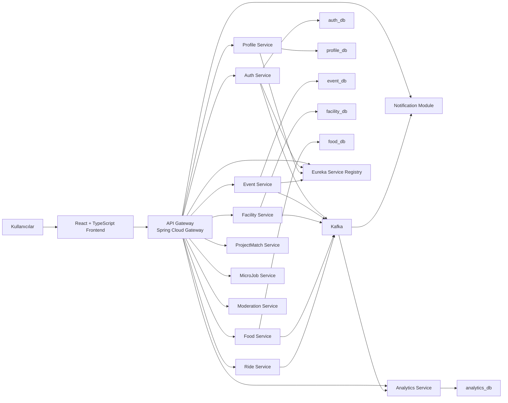
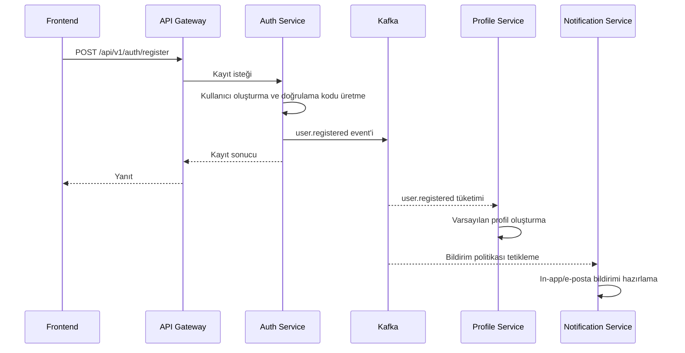
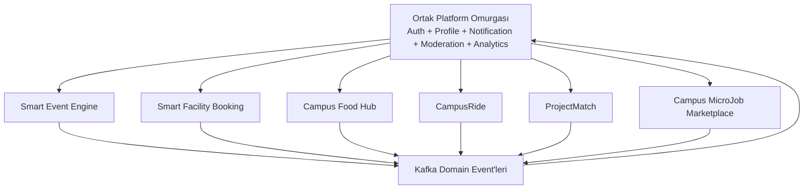

# IsikCampusOS Tez Taslağı - Bölüm 3

Bu dosya, Word şablonuna aktarılmadan önce Bölüm 3 içerik akışını kontrol etmek için hazırlanmış çalışma taslağıdır.

Tez başlığı: IsikCampusOS: Mikroservis Tabanlı Dijital Kampüs Platformu  
Öğrenci: Tolga Olguner  
Öğrenci No: 23YOBI1053  
Danışman: Dr. Şahin Aydın

---

# BÖLÜM 3: YÖNTEM

Bu bölümde IsikCampusOS platformunun tasarım yaklaşımı, sistem mimarisi, servis yapısı, veri yönetimi, güvenlik modeli ve kullanıcı arayüzü yaklaşımı açıklanmaktadır. Çalışmanın yöntemi, kampüs içi sosyal ve operasyonel süreçlerin analiz edilmesi, bu süreçlerin domain bazlı modüllere ayrılması ve her domain için mikroservis tabanlı bir sistem tasarımının oluşturulması üzerine kuruludur.

Tez kapsamında sistem, final ürün mimarisi bakış açısıyla ele alınmıştır. Bu nedenle yalnızca mevcut çekirdek modüller değil, platformun planlanan nihai modülleri de sistem tasarımının parçası olarak değerlendirilmiştir. Böylece IsikCampusOS; kimlik doğrulama, profil, kulüp ve etkinlik yönetimi, bildirim, tesis rezervasyonu, yemek siparişi, kampüs yolculuğu, proje eşleştirme, mikro iş pazaryeri, moderasyon ve analitik bileşenlerinden oluşan bütünleşik bir dijital kampüs platformu olarak modellenmiştir.

## 3.1. Sistem Tasarımı

IsikCampusOS'un sistem tasarımı üç temel ilkeye dayanmaktadır. Birinci ilke, kampüs içi süreçleri tek kullanıcı deneyimi altında birleştirmektir. İkinci ilke, domain sınırlarını mikroservis mimarisiyle netleştirmektir. Üçüncü ilke ise sistemin ileride yeni kampüs modülleriyle genişleyebilmesi için modüler ve event-driven bir altyapı kurmaktır.

Bu doğrultuda sistem; frontend, API Gateway, servis keşfi, domain servisleri, mesajlaşma altyapısı, veri katmanı ve gözlemlenebilirlik bileşenlerinden oluşan çok katmanlı bir mimariyle tasarlanmıştır. Frontend katmanı React ve TypeScript ile geliştirilmiştir. Backend katmanında Java ve Spring Boot tabanlı servisler yer almaktadır. İstemci talepleri doğrudan domain servislerine gitmemekte, Spring Cloud Gateway tabanlı API Gateway üzerinden yönlendirilmektedir. Servis kayıt ve keşif işlemleri Eureka ile yapılmakta, servisler arası asenkron iletişim Kafka event'leriyle desteklenmektedir. Veri katmanında PostgreSQL kullanılmakta ve her domain servisinin kendi veri alanına sahip olması hedeflenmektedir.

### 3.1.1. Tasarım Yaklaşımı

Sistem tasarımına başlamadan önce kampüs içi temel aktörler ve bu aktörlerin ihtiyaçları belirlenmiştir. Öğrenciler etkinlikleri keşfetmek, kulüplere katılmak, kampüs hizmetlerine erişmek ve bildirim almak ister. Kulüp başkanları etkinlik oluşturmak, üye yönetmek, duyuru yapmak ve katılımı takip etmek ister. SKS yetkilileri kulüp ve etkinlik süreçlerini onaylamak, düzenlemek ve denetlemek ister. Registrar kullanıcı ve öğrenci kayıtlarını yönetir. Admin ise sistem genelinde kullanıcı, rol, güvenlik, analitik ve moderasyon süreçlerini izler.

Bu ihtiyaçlar, sistemin yalnızca tek bir kullanıcı rolüne göre değil, rol bazlı ve süreç odaklı tasarlanmasını gerektirmiştir. Bu nedenle IsikCampusOS'ta roller, ekranlar, API uçları ve domain servisleri birbirleriyle uyumlu olacak şekilde modellenmiştir. Kullanıcı arayüzü tarafında öğrenci, SKS, kulüp başkanı, registrar ve admin için farklı dashboard mantıkları kurgulanmıştır. Backend tarafında ise her domain kendi sorumluluğunu taşıyan servislerle temsil edilmiştir.

Tablo 3.1, sistemdeki temel kullanıcı rollerini ve bu rollerin sistem içindeki ana sorumluluklarını göstermektedir.

**Tablo 3.1. IsikCampusOS kullanıcı rolleri ve sorumlulukları**

| Rol | Temel Sorumluluk | Örnek İşlemler |
| --- | --- | --- |
| Öğrenci | Kampüs hizmetlerine erişim | Etkinlik keşfi, kulübe katılım, RSVP, bildirim takibi |
| Kulüp Başkanı | Kulüp ve etkinlik operasyonu | Etkinlik oluşturma, üye yönetimi, duyuru yayınlama, check-in |
| SKS Yetkilisi | Onay ve denetim | Kulüp onayı, etkinlik onayı, revizyon talebi, rapor izleme |
| Registrar | Öğrenci yönetimi | Öğrenci oluşturma, güncelleme, durum değiştirme |
| Admin | Sistem yönetimi | Rol yönetimi, analitik, moderasyon, sistem izleme |
| Tesis Yetkilisi | Tesis rezervasyon yönetimi | Kaynak tanımlama, rezervasyon onayı, no-show takibi |
| İşletme Yetkilisi | Kampüs içi sipariş yönetimi | Menü yönetimi, sipariş durumu güncelleme |

### 3.1.2. Genel Mimari

IsikCampusOS'un genel mimarisi, istemci uygulaması ile backend servisleri arasında merkezi bir API Gateway kullanır. Bu yapı, frontend tarafında servis karmaşıklığını azaltır ve kimlik doğrulama, yönlendirme, CORS ve ileride rate limiting gibi çapraz kesen sorumlulukların tek noktada ele alınmasını sağlar.

Şekil 3.1'de sistemin genel mimari görünümü verilmiştir. Bu diyagram Word dosyasına aktarılırken görsel olarak yeniden çizilecek veya yüksek çözünürlüklü şekle dönüştürülecektir.

**Şekil 3.1. IsikCampusOS genel sistem mimarisi**

Bu mimaride frontend tüm isteklerini API Gateway'e gönderir. Gateway, ilgili isteği route tanımlarına göre uygun servise aktarır. Örneğin `/api/v1/auth/**` istekleri auth-service'e, `/api/v1/profiles/**` istekleri profile-service'e, `/api/v1/events/**` ve `/api/v1/clubs/**` istekleri event-service'e yönlendirilir. Bildirim, akademik personel ve sertifika doğrulama gibi ek uçlar da gateway üzerinden dışa açılır.

### 3.1.3. Servis Sınırları

Sistemin servis sınırları domain odaklı belirlenmiştir. Her servis belirli bir iş alanının veri modelini ve iş kurallarını yönetir. Bu yaklaşım, servislerin birbirinin veritabanına doğrudan erişmemesini ve aralarındaki iletişimin API veya event üzerinden kurulmasını hedefler.

Tablo 3.2, final ürün mimarisinde yer alan temel servisleri ve sorumluluklarını göstermektedir.

**Tablo 3.2. Final ürün mimarisindeki servisler**

| Servis | Sorumluluk | Veri Alanı |
| --- | --- | --- |
| API Gateway | Merkezi yönlendirme ve JWT doğrulama | Kalıcı domain verisi tutmaz |
| Eureka Server | Servis kayıt ve keşif | Servis instance bilgisi |
| Auth Service | Kimlik, giriş, e-posta doğrulama, öğrenci yönetimi | Kullanıcı, rol, doğrulama, sertifika |
| Profile Service | Kullanıcı profili ve temel profil verileri | Profil, bölüm, ilgi alanı, beceri |
| Event Service | Kulüp, etkinlik, RSVP, check-in, duyuru | Kulüp, üye, etkinlik, katılım |
| Notification Service | In-app ve e-posta bildirimleri | Bildirim, okundu bilgisi, teslimat |
| Facility Service | Tesis ve kaynak rezervasyonu | Tesis, kaynak, slot, rezervasyon |
| Food Service | Kampüs içi yemek siparişi | Vendor, menü, sipariş |
| Ride Service | Kampüs yolculuğu eşleştirme | Yolculuk ilanı, eşleşme, puanlama |
| ProjectMatch Service | Proje ve ekip eşleştirme | Beceri profili, proje, davet |
| MicroJob Service | Kampüs içi mikro iş pazaryeri | İş ilanı, teklif, sözleşme |
| Moderation Service | Raporlama ve içerik denetimi | Rapor, vaka, yaptırım |
| Analytics Service | Kullanım metrikleri ve dashboard | Olay kayıtları, özet metrikler |

Mevcut geliştirme yapısında çekirdek servisler API Gateway, Eureka, Auth, Profile ve Event ekseninde yoğunlaşmıştır. Final ürün mimarisi ise bu çekirdek üzerine yeni domain servislerinin eklenmesini öngörmektedir. Bu yaklaşım, bitirme projesinin kapsamını yalnızca mevcut kod parçalarıyla değil, sistemin hedef mimarisiyle birlikte değerlendirmeyi sağlar.

### 3.1.4. Veri Yönetimi ve Servis Bazlı Veritabanı

IsikCampusOS'ta veri yönetimi servis bazlı veri sahipliği ilkesine dayanır. Her mikroservis kendi domain verisinden sorumludur. Örneğin auth-service kullanıcı ve rol verisini, profile-service profil verisini, event-service kulüp ve etkinlik verisini yönetir. Final mimaride facility-service rezervasyon verisini, food-service sipariş verisini, analytics-service ise olay ve metrik verisini ayrı veri alanlarında tutar.

Bu yaklaşımın temel amacı domain sınırlarını korumaktır. Bir servisin başka bir servisin veritabanına doğrudan erişmesi, servisler arasında gizli bağımlılıklar oluşturur ve mikroservis mimarisinin bağımsız geliştirme avantajını zayıflatır. Bu nedenle servisler arası veri paylaşımı REST API çağrıları veya Kafka event'leri üzerinden yapılacak şekilde tasarlanmıştır.

Veri yönetimi açısından PostgreSQL ana ilişkisel veritabanı olarak seçilmiştir. Geliştirme ortamında tek PostgreSQL container içinde `auth_db`, `profile_db` ve `event_db` gibi ayrı veritabanları kullanılmaktadır. Final mimari bakışında her servis kendi veritabanı alanını yönetir. Böylece veri modeli değişiklikleri servis sınırları içinde tutulur ve yeni modüllerin eklenmesi daha kontrollü hale gelir.

### 3.1.5. Servisler Arası İletişim

Sistemde servisler arası iletişim iki şekilde tasarlanmıştır: senkron REST iletişimi ve asenkron event-driven iletişim. Senkron iletişim, kullanıcının anlık cevap beklediği işlemlerde kullanılır. Örneğin frontend bir etkinlik listesini istediğinde API Gateway üzerinden event-service'e REST isteği gönderilir. Kullanıcı giriş yaptığında auth-service kimlik bilgilerini doğrular ve token üretir.

Asenkron iletişim ise bir domain olayının diğer servisleri tetiklemesi gereken durumlarda kullanılır. Örneğin kullanıcı kaydı tamamlandığında `user.registered` olayı yayınlanabilir. Profile-service bu olayı tüketerek kullanıcı için otomatik profil oluşturabilir. Etkinlik yayınlandığında bildirim ve analitik servisleri bu olaya tepki verebilir. Bu yapı, servislerin birbirine doğrudan ve sıkı biçimde bağlanmasını azaltır.

Şekil 3.2, kullanıcı kaydı sonrası profil oluşturma ve bildirim akışının event-driven mantığını göstermektedir.

**Şekil 3.2. Kullanıcı kaydı sonrası event-driven veri akışı**

Bu tasarım özellikle genişleyen sistemlerde önemlidir. Yeni bir servis, mevcut auth-service kodunu değiştirmeden `user.registered`, `event.published` veya `booking.created` gibi olayları tüketerek sisteme dahil olabilir. Bu durum, platformun modüler genişlemesini kolaylaştırır.

### 3.1.6. Güvenlik ve Yetkilendirme Tasarımı

IsikCampusOS güvenlik modeli üç temel katmandan oluşmaktadır: kimlik doğrulama, merkezi token kontrolü ve rol bazlı yetkilendirme. Kimlik doğrulama auth-service tarafından yapılır. Kullanıcı giriş yaptığında JWT üretilir. Frontend sonraki isteklerde bu token'ı API Gateway'e gönderir. API Gateway token'ı doğrular ve downstream servislere kullanıcı kimliği ile rol bilgisini aktarır.

Bu tasarımın amacı, her domain servisinin tekrar tekrar token doğrulama ayrıntılarıyla uğraşmasını azaltmak ve sistem genelinde tutarlı bir güvenlik modeli kurmaktır. Bununla birlikte domain servisleri yalnızca gateway'e güvenmekle kalmaz; kaynak sahipliği ve rol bazlı iş kurallarını kendi domain mantığı içinde de kontrol eder. Örneğin bir kulüp başkanı yalnızca yönettiği kulübün etkinliklerini düzenleyebilmelidir. SKS yetkilisi ise etkinlik onay ve revizyon süreçlerinde daha geniş yetkilere sahiptir.

Tablo 3.3, bazı kritik işlemler için örnek yetkilendirme kararlarını göstermektedir.

**Tablo 3.3. Örnek RBAC yetkilendirme matrisi**

| İşlem | Öğrenci | Kulüp Başkanı | SKS Yetkilisi | Registrar | Admin |
| --- | --- | --- | --- | --- | --- |
| Etkinlikleri görüntüleme | Evet | Evet | Evet | Evet | Evet |
| Etkinliğe RSVP yapma | Evet | Evet | Evet | Hayır | Hayır |
| Etkinlik taslağı oluşturma | Hayır | Evet | Evet | Hayır | Evet |
| Etkinlik onaylama | Hayır | Hayır | Evet | Hayır | Evet |
| Öğrenci oluşturma | Hayır | Hayır | Hayır | Evet | Evet |
| Kulüp durumunu değiştirme | Hayır | Hayır | Evet | Hayır | Evet |
| Sistem analitiğini görüntüleme | Hayır | Sınırlı | Evet | Sınırlı | Evet |

### 3.1.7. Frontend Tasarımı

Frontend katmanı React, TypeScript ve Vite ile yapılandırılmıştır. Kullanıcı arayüzü rol bazlı ekranlardan oluşur. Öğrenci dashboard'u etkinlikler, kulüpler, bildirimler ve profil gibi gündelik işlemlere odaklanır. SKS dashboard'u onay bekleyen etkinlikler, kulüp talepleri ve idari işlem akışlarını öne çıkarır. Kulüp başkanı dashboard'u etkinlik oluşturma, üyelik yönetimi, duyuru yayınlama ve katılımcı takibi gibi işlemleri içerir. Registrar dashboard'u öğrenci yönetimi ve kullanıcı durum kontrollerini destekler.

Frontend tarafında state yönetimi için store tabanlı bir yaklaşım kullanılmıştır. Auth, event, club, notification ve academic staff gibi alanlar ayrı store yapılarıyla yönetilir. Bu yapı, frontend içinde domain verisinin daha okunabilir ve modüler kalmasını sağlar. API çağrıları merkezi bir API katmanı üzerinden yapılır ve gateway base URL'i üzerinden backend servislerine ulaşılır.

Kullanıcı deneyimi açısından sistemin amacı, kampüs hizmetlerini tek bir görsel dil ve navigasyon yapısı içinde sunmaktır. Öğrencinin etkinlik keşfi, kulüp detayları, bildirimler ve profil işlemleri arasında kopukluk yaşamaması hedeflenmiştir. Yönetici rollerinde ise tekrar eden işlemler, onay kuyrukları ve durum güncellemeleri dashboard mantığıyla düzenlenmiştir.

### 3.1.8. Dağıtım, Altyapı ve Gözlemlenebilirlik

Geliştirme ve demo ortamında sistem Docker Compose ile desteklenen bir altyapı üzerinde çalışacak şekilde tasarlanmıştır. Altyapı bileşenleri arasında PostgreSQL, Kafka, Zookeeper, Redis, Zipkin ve Mailpit bulunmaktadır. PostgreSQL servis verilerini tutar. Kafka ve Zookeeper event-driven iletişim altyapısını sağlar. Redis ileride rate limiting veya geçici veri senaryolarında kullanılabilir. Zipkin dağıtık izleme için, Mailpit ise geliştirme ortamında e-posta akışlarını test etmek için kullanılır.

Gözlemlenebilirlik, mikroservis tabanlı sistemlerde kritik bir gereksinimdir. Bir işlem birden fazla servisten geçebileceği için hata kaynağını bulmak monolitik sistemlere göre daha zor olabilir. Zipkin gibi dağıtık izleme araçları, isteklerin servisler arasında nasıl ilerlediğini görünür hale getirir. Ayrıca servislerin health bilgileri, log kayıtları ve ileride eklenecek metrik dashboard'ları sistem operasyonunun izlenmesine katkı sağlar.

### 3.1.9. Final Ürün Mimarisinde Modül Genişleme Stratejisi

IsikCampusOS'un final ürün mimarisi, çekirdek servisler üzerine yeni kampüs modüllerinin eklenmesini öngörmektedir. Bu stratejide auth-service, profile-service, notification-service, moderation-service ve analytics-service ortak platform omurgasını oluşturur. Facility, Food, Ride, ProjectMatch ve MicroJob gibi servisler ise bu omurga üzerinde çalışan domain modülleridir.

Bu genişleme stratejisinin ana avantajı, yeni modüllerin temel kimlik, rol, bildirim ve analitik altyapısını yeniden geliştirmek zorunda kalmamasıdır. Örneğin Facility Booking modülü bir rezervasyon oluşturduğunda bu olay notification-service tarafından bildirim üretmek ve analytics-service tarafından kullanım metriğine dönüştürmek için tüketilebilir. Food Hub modülü sipariş durumlarını kendi domain'inde yönetirken kullanıcı kimliği ve bildirim altyapısını ortak platformdan alabilir. ProjectMatch ve MicroJob gibi modüller ise profil, beceri ve güven sinyallerinden yararlanabilir.

Şekil 3.3, ortak platform omurgası ile domain modülleri arasındaki ilişkiyi göstermektedir.

**Şekil 3.3. Ortak platform omurgası ve domain modülleri**

Bu yapı, IsikCampusOS'un yalnızca tek bir modülden oluşan kapalı bir uygulama değil, kampüs süreçlerinin zaman içinde genişletilebileceği bir dijital platform olarak tasarlanmasını sağlar.

### 3.1.10. Yöntemin Değerlendirme Yaklaşımı

Bu tez kapsamında gerçek kullanıcı testi veya üretim ortamı performans ölçümü yapılmamıştır. Bu nedenle değerlendirme bölümü teknik analiz, senaryo değerlendirmesi ve beklenen kazanımlar üzerinden yürütülecektir. Sistem tasarımı; modülerlik, genişletilebilirlik, rol bazlı yönetim, izlenebilirlik, servis sınırlarının açıklığı ve kampüs süreçlerini bütünleştirme kapasitesi açısından incelenecektir.

Bu yöntem, bitirme projesinin kapsamı açısından uygundur. Çünkü çalışmanın temel amacı, üretim ortamında çalışan ticari bir ürünün performansını ölçmekten çok, kampüs içi süreçleri ele alan mikroservis tabanlı bir yönetim bilişim sistemi tasarımını ortaya koymaktır. Bu nedenle sonraki bölümlerde uygulama bileşenleri detaylandırılacak, ardından sistemin beklenen kazanımları ve sınırlılıkları tartışılacaktır.

---

# Bölüm 3 İçin Kullanılacak Kaynak Notları

Bu bölümde doğrudan uzun literatür tartışması yapılmayacak; ancak teknik kararlar aşağıdaki kaynaklarla desteklenecektir:

- Spring Cloud Gateway resmi dokümantasyonu: API Gateway ve yönlendirme yaklaşımı.
- Spring Cloud Netflix resmi dokümantasyonu: Eureka servis keşfi.
- Apache Kafka resmi dokümantasyonu: publish-subscribe/event streaming yaklaşımı.
- OpenZipkin resmi dokümantasyonu: dağıtık izleme ve span/trace mantığı.
- Söylemez, Tekinerdogan ve Tarhan (2022): mikroservis avantajları ve zorlukları.
- Montesi ve Weber (2016): API Gateway, service discovery ve circuit breaker desenleri.
