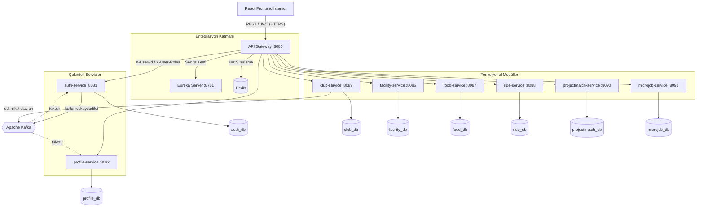
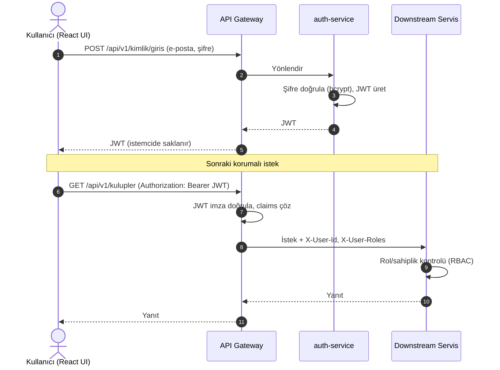
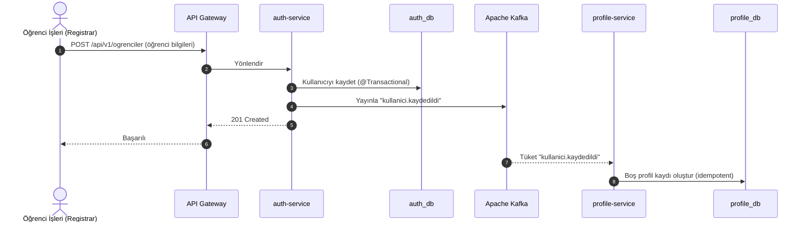
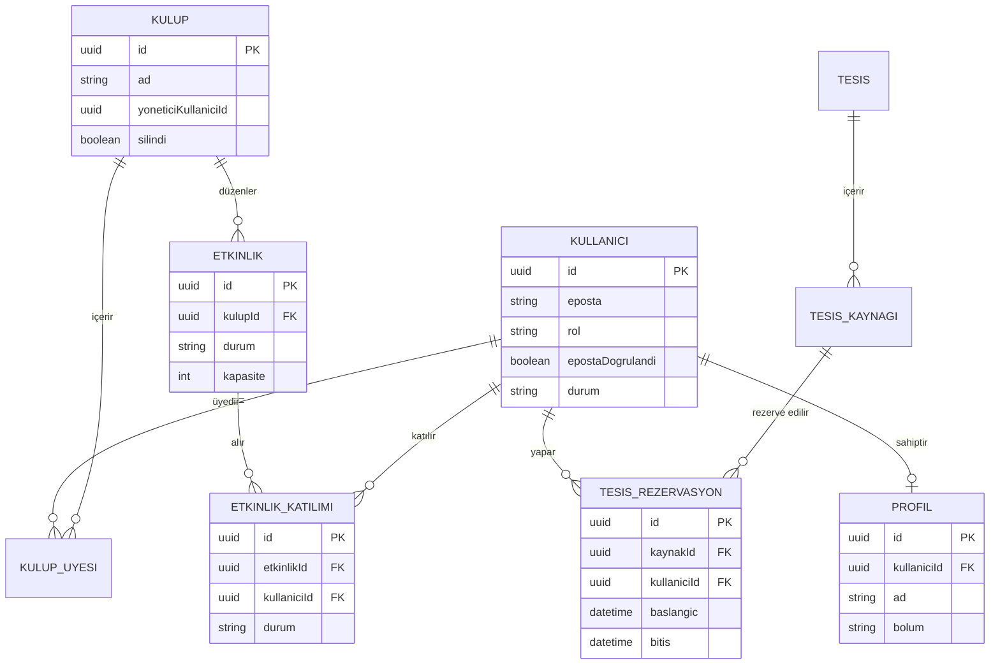
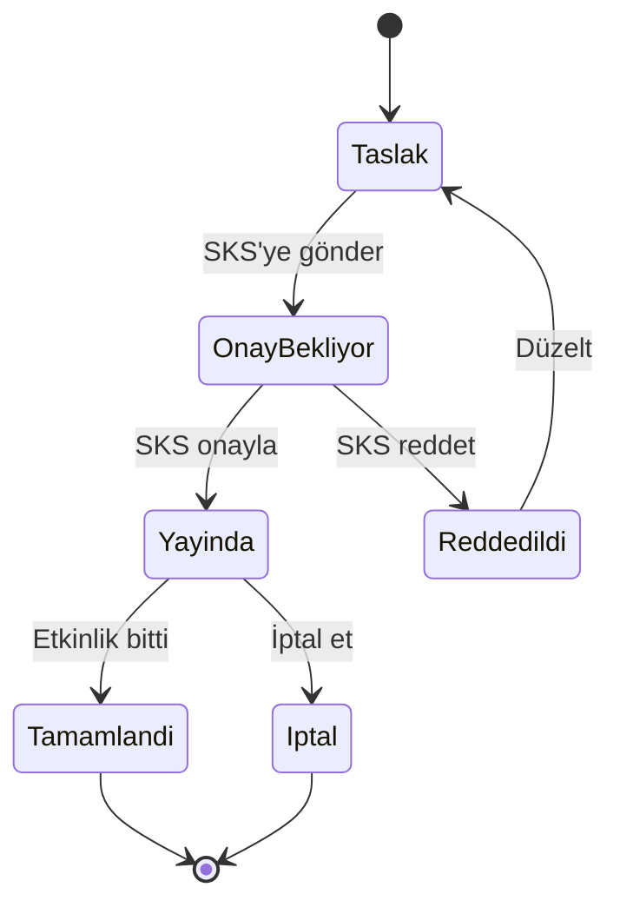
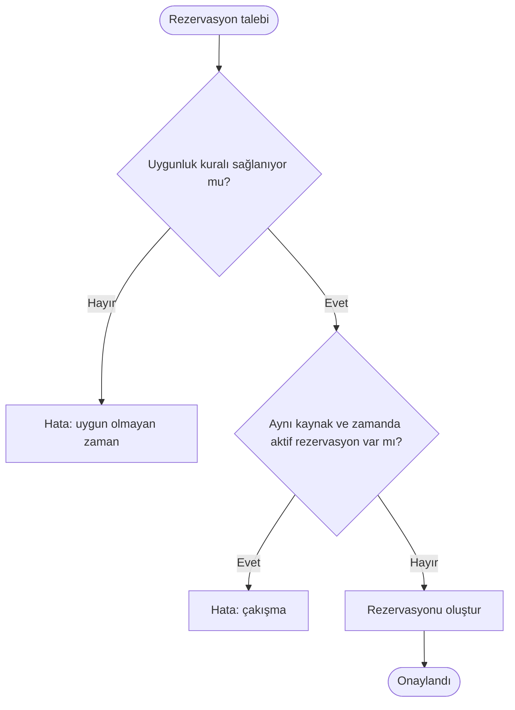
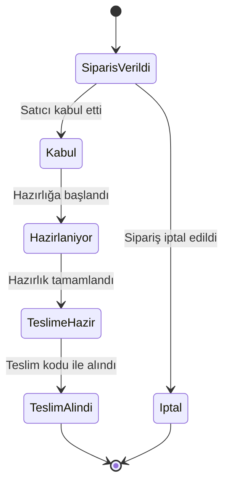
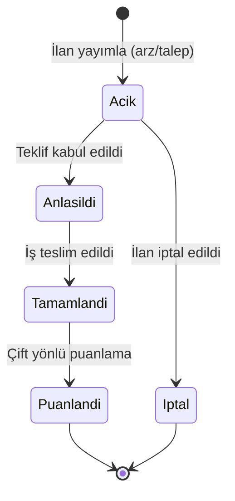
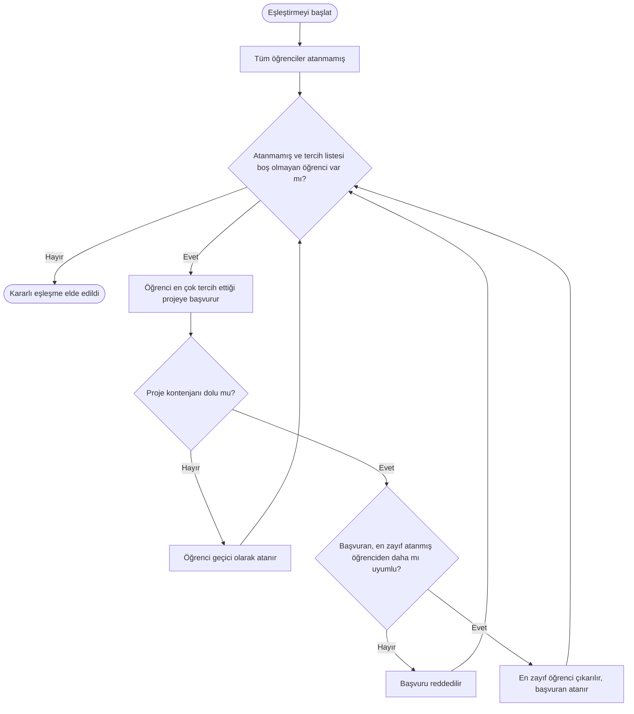

# BÖLÜM 3: METODOLOJİ VE SİSTEM TASARIMI (METHODOLOGY & SYSTEM DESIGN)

Bu bölümde, IsikCampusOS bütünleşik akıllı kampüs platformunun geliştirilmesinde izlenen yazılım mühendisliği metodolojisi ile sistemin teknik tasarımı sunulmaktadır. Bölüm; geliştirme yaklaşımından başlayarak dağıtık sistem mimarisini, kimlik doğrulama ve güvenlik altyapısını, olay güdümlü servis entegrasyonunu, veri tabanı tasarımını ve platformun barındırdığı fonksiyonel modüllerin tasarım modellerini ele almaktadır. Tasarım kararları, Bölüm 2'de ortaya konan kuramsal temeller (bütünleşik portal, bilişsel yük, kapalı topluluk güveni) ile gerekçelendirilmekte; teknik tercihler ise ilgili yazılım mimarisi literatürüne dayandırılmaktadır.

---

## 3.1. Geliştirme Metodolojisi

### 3.1.1. Yinelemeli ve Artımlı Geliştirme Yaklaşımı

IsikCampusOS, çok modüllü ve geniş kapsamlı bir platform olduğundan, gereksinimlerin baştan eksiksiz tanımlanmasını gerektiren doğrusal (waterfall) modeller yerine **yinelemeli ve artımlı (iterative and incremental)** bir geliştirme yaklaşımı benimsenmiştir. Bu yaklaşımda platform, tek seferde değil; çalışan ve gösterilebilir parçalar halinde, art arda gelen geliştirme döngüleriyle inşa edilmiştir. Her döngüde önce çekirdek altyapı, ardından bu altyapı üzerine oturan fonksiyonel bir modül uçtan uca (backend + ön yüz) tamamlanmıştır.

Bu yaklaşım, çevik gereksinim mühendisliği ilkeleriyle uyumludur (Daun vd., 2023). Modüller arasındaki bağımlılıkların erken aşamada görünür kılınması, gereksinim değişikliklerinin sınırlı bir kapsamda yönetilebilmesini sağlamıştır. Akademik bağlamda yürütülen yazılım projelerinde bu tür artımlı yaklaşımların, hem teknik riski hem de kapsam belirsizliğini azalttığı gösterilmiştir (Mahnič, 2012).

### 3.1.2. Geliştirme Döngüsünün Yapısı

Geliştirme süreci, her biri belirli bir teslimat hedefi olan döngüler halinde yürütülmüştür:

1. **Çekirdek altyapı döngüsü:** Servis keşfi (Eureka), API Gateway, container orkestrasyonu (Docker Compose) ve mesajlaşma altyapısı (Kafka) kurulmuştur.
2. **Kimlik ve profil döngüsü:** Kullanıcı kimliği, üniversite e-postası doğrulaması ve profil yönetimi tamamlanmıştır.
3. **Modül döngüleri:** Her fonksiyonel modül (kulüp/etkinlik, tesis rezervasyon, yemek, paylaşımlı yolculuk, proje eşleştirme, mikro iş) sırayla, kendi içinde uçtan uca çalışır biçimde geliştirilmiştir.

Her döngünün sonunda, üretilen yazılım parçası çalışır durumda gösterilebilir hâle getirilmiş; bir sonraki döngünün kapsamı, ortaya çıkan teknik gerçeklikler ışığında güncellenmiştir.

### 3.1.3. Tasarım Odaklı Düşünce ve Kullanıcı Deneyimi

Platformun ön yüz tasarımında, Bölüm 2'de ele alınan bilişsel yük (Sweller, 1988) ve arayüz tutarlılığı ilkeleri doğrultusunda kullanıcı odaklı bir tasarım yaklaşımı izlenmiştir. Tüm modüller ortak bir tasarım dili (ortak bileşenler, tutarlı renk ve tipografi hiyerarşisi, standart kart ve liste düzenleri) üzerine inşa edilerek, kullanıcının modüller arası geçişte karşılaştığı bilişsel maliyet en aza indirilmiştir.

---

## 3.2. Sistem Mimarisi

### 3.2.1. Mimari Yaklaşım: Mikroservisler

IsikCampusOS, **mikroservis mimarisi** ile tasarlanmıştır. Bu tercih; bağımsız geliştirilebilirlik, hata izolasyonu ve modül bazlı ölçeklenebilirlik gerekçeleriyle yapılmıştır (Newman, 2021; Di Francesco vd., 2019). Her fonksiyonel domain, kendi iş mantığına, kendi veri tabanına ve kendi dağıtım birimine sahip bağımsız bir Spring Boot servisi olarak gerçekleştirilmiştir.

Monolitik ve mikroservis mimarilerini karşılaştıran çalışmalar, mikroservis yaklaşımının yatay ölçeklenme ve bağımsız dağıtım açısından avantaj sağladığını; buna karşılık dağıtık yapının operasyonel karmaşıklık getirdiğini göstermektedir (Blinowski vd., 2022). Bu farkındalıkla, platformdaki servis sayısı domain sınırlarına göre ölçülü tutulmuş ve yalnızca anlamlı sınırlarda servis ayrımına gidilmiştir.

Proje, tüm servislerin tek bir Git deposunda yönetildiği **monorepo** yapısında kurgulanmıştır. Bu yapı, servisler arası ortak sözleşmelerin tek yerde yönetilmesini ve geliştirme koordinasyonunu kolaylaştırmıştır.

### 3.2.2. Servis Kataloğu

Platform, altyapı servisleri ve domain servisleri olmak üzere iki katmandan oluşur. Servislerin sorumlulukları ve port atamaları Tablo 3.1'de sunulmuştur.

> **[TABLO 3.1 — Servis Kataloğu]** Aşağıdaki tablo doğrudan kullanılabilir.

| Katman | Servis | Port | Sorumluluk |
|--------|--------|------|------------|
| Altyapı | `eureka-server` | 8761 | Servis kayıt ve keşfi |
| Altyapı | `api-gateway` | 8080 | Yönlendirme, merkezi JWT doğrulama, CORS |
| Domain | `auth-service` | 8081 | Kimlik, JWT üretimi, e-posta doğrulama, kullanıcı yönetimi |
| Domain | `profile-service` | 8082 | Profil yönetimi, beceri etiketleri |
| Domain | `facility-service` | 8086 | Tesis ve kaynak rezervasyonu, çakışma kontrolü |
| Domain | `food-service` | 8087 | Satıcı, menü ve sipariş yönetimi |
| Domain | `ride-service` | 8088 | Paylaşımlı yolculuk ilanı ve eşleştirme |
| Domain | `club-service` | 8089 | Kulüp, etkinlik, RSVP, bildirim |
| Domain | `projectmatch-service` | 8090 | Beceri tabanlı proje ekip eşleştirme |
| Domain | `microjob-service` | 8091 | Kampüs içi mikro iş ilanı ve teklif |

Altyapı bileşenleri olarak ayrıca PostgreSQL (servis başına veri tabanı), Apache Kafka ve Zookeeper (asenkron mesajlaşma), Redis (önbellek ve hız sınırlama) ve Zipkin (dağıtık izleme) kullanılmıştır.

### 3.2.3. Genel Mimari Şeması

Sistemin genel mimarisi; istemciden gelen isteklerin API Gateway üzerinden domain servislerine yönlendirilmesini, servislerin Eureka üzerinden birbirini keşfetmesini ve Kafka üzerinden asenkron olarak haberleşmesini içerir. Genel mimari Şekil 3.1'de gösterilmektedir.

> **[ŞEKİL 3.1 — Genel Sistem Mimarisi]** Aşağıdaki Mermaid diyagramı doğrudan kullanılabilir. (Tez Word dosyasında, eğer Mermaid desteklenmiyorsa diagrams.net/draw.io ile aynı yapı çizilebilir: İstemci → Gateway → servis kümesi; yan tarafta Eureka ve Redis; altta Kafka ve veri tabanları.)

### 3.2.4. Spring Cloud Entegrasyon Katmanı

Servisler arası ağ trafiği ve dış dünyadan gelen istekler, Spring Cloud bileşenleriyle yönetilmiştir:

- **API Gateway (Spring Cloud Gateway):** İstemci hiçbir domain servisine doğrudan erişemez. Tüm istekler `/api/v1/...` temel yolu üzerinden Gateway tarafından karşılanır. Gateway; rota eşleme, CORS politikaları, kimlik doğrulama filtresi ve hız sınırlama (rate limiting) sorumluluklarını üstlenir. Gateway'in yönlendirme yapısı Türkçe yol adları üzerine kuruludur (örneğin `/api/v1/kimlik/**` → auth-service, `/api/v1/kulupler/**` → club-service, `/api/v1/tesisler/**` → facility-service).
- **Eureka (Service Registry & Discovery):** Tüm servisler başlangıçta Eureka'ya kendi adları ve ağ konumlarıyla kaydolur. Servisler birbirini sabit IP adresi yerine servis adıyla bulur; bu, dinamik ölçeklenmeyi kolaylaştırır.

### 3.2.5. Mimari Karar: Bildirim Sorumluluğunun Konumu

Mikroservis mimarisinde "her işlev için ayrı servis" yaklaşımı her zaman doğru değildir; gereksiz servis ayrımı operasyonel karmaşıklığı artırır (Taibi vd., 2017). Bu farkındalıkla, bildirim (in-app notification) işlevi ayrı bir servise çıkarılmak yerine, mevcut sürümde bildirimin yegâne tüketicisi olan club-service içinde konumlandırılmıştır. Bu, kanıta dayalı bilinçli bir tasarım kararıdır: bildirim üreten ikinci bir modül devreye girdiğinde, bildirim olay güdümlü bağımsız bir servise ayrılacak biçimde tasarlanmıştır. Bu yaklaşım, mimari kararların gereksinimlerle birlikte evrildiği artımlı geliştirme felsefesiyle tutarlıdır.

---

## 3.3. Kimlik Doğrulama ve Güvenlik Tasarımı

### 3.3.1. Merkezi Kimlik Doğrulama ve Tek Oturum (SSO)

Süper-uygulama modelinde kullanıcı, tüm modüllere tek bir oturumla erişebilmelidir. Bu deneyimi sağlamak için **durumsuz (stateless) kimlik doğrulama** mimarisi kurulmuştur. Mikroservis mimarilerinde kimlik doğrulama ve yetkilendirme üzerine yapılan sistematik incelemeler, API Gateway ve JSON Web Token (JWT) bileşenlerinin bu bağlamda en yaygın ve uygun çözümler olduğunu ortaya koymaktadır (de Almeida & Canedo, 2022). Platformun güvenlik akışı şu adımlardan oluşur:

1. Kullanıcı, `auth-service` üzerinden üniversite e-postası ve şifresiyle giriş yapar. Şifreler bcrypt ile özetlenerek saklanır.
2. `auth-service`, kullanıcının kimliğini ve rollerini içeren, kriptografik olarak imzalanmış bir JWT üretir ve istemciye döner.
3. İstemci, sonraki tüm isteklerinde bu token'ı `Authorization: Bearer <token>` başlığıyla API Gateway'e gönderir.
4. API Gateway, korumalı rotalarda token'ın imzasını merkezî olarak doğrular. Geçerli istekte token içindeki kullanıcı kimliği ve roller çözümlenerek downstream servise `X-User-Id` ve `X-User-Roles` HTTP başlıkları olarak iletilir.
5. Downstream servis, ek bir veri tabanı sorgusu yapmadan bu başlıkları okuyarak rol bazlı yetkilendirmeyi gerçekleştirir.

Bu yaklaşım, Spring Security tabanlı mikroservislerde merkezî bir güvenlik katmanıyla API'lerin korunmasına ilişkin uygulamalı çalışmalarla da uyumludur (Chatterjee & Prinz, 2022). Bu akış Şekil 3.2'de gösterilmektedir.

> **[ŞEKİL 3.2 — JWT Tabanlı Kimlik Doğrulama Akışı]** Aşağıdaki Mermaid ardışıklık (sequence) diyagramı doğrudan kullanılabilir.

### 3.3.2. Rol Bazlı Erişim Kontrolü (RBAC)

Yetkilendirme, rol bazlı erişim kontrolü (RBAC) ile sağlanır. Roller JWT içinde taşınır ve iki türde ele alınır:

- **Sistem rolleri:** `ROLE_STUDENT`, `ROLE_REGISTRAR`, `ROLE_SKS_ADMIN`, `ROLE_FACILITY_ADMIN`, `ROLE_ADMIN` gibi kalıcı roller.
- **Domain rolü:** Bir kaynağa özgü, üyelik kaydında tutulan rol (örneğin kulüp başkanlığı). Bu, sistem rolü değildir; ilgili servisin kendi veri modelinde yönetilir.

Yetki yalnızca role göre değil; **sahiplik (ownership)**, kaynak durumu ve bağlam dikkate alınarak da kontrol edilir. Örneğin bir kulüp başkanı yalnızca kendi kulübünün etkinliklerini yönetebilir; bir öğrenci yalnızca kendi rezervasyonunu iptal edebilir. Bu çok katmanlı yetkilendirme, her servisin kendi domain katmanında uygulanır.

### 3.3.3. Kapalı Topluluk ve Güvenlik Önlemleri

Platform, yalnızca doğrulanmış üniversite üyelerine açık **kapalı bir ekosistem** olarak tasarlanmıştır. Bu, Bölüm 2'de ele alınan kapalı topluluk güveni (ter Huurne vd., 2017) ilkesinin teknik karşılığıdır. Temel güvenlik önlemleri şunlardır:

- Üniversite e-posta alan adı kontrolü ve zorunlu e-posta doğrulaması.
- İlk girişte zorunlu şifre değiştirme akışı.
- Kritik aksiyonların denetim günlüğüne (audit log) kaydedilmesi.
- Mantıksal silme (soft-delete) ile geçmişe dönük izlenebilirliğin korunması.
- Hassas yapılandırma değerlerinin (JWT imza anahtarı vb.) ortam değişkenleri üzerinden yönetilmesi.

---

## 3.4. Olay Güdümlü Entegrasyon

### 3.4.1. Asenkron İletişim Gereksinimi

Dağıtık sistemlerde servisler arası senkron (REST) çağrı zincirleri, gecikme birikmesine ve zincirleme hatalara (cascading failures) yol açabilir. Servisleri gevşek bağlı (loosely coupled) tutmak ve ana iş akışını bloklamadan yan etkileri (bildirim, profil oluşturma, sertifika üretimi) yürütmek amacıyla **Apache Kafka tabanlı olay güdümlü mimari** benimsenmiştir (Newman, 2021).

### 3.4.2. Olay Akışları ve Topic Tasarımı

Servisler, ürettikleri durum değişikliklerini Kafka topic'lerine birer **domain olayı** olarak yayar; ilgilenen servisler bu topic'lere abone olarak olayları tüketir. Platformda kullanılan başlıca olay akışları Tablo 3.2'de sunulmuştur.

> **[TABLO 3.2 — Kafka Olay Akışları]** Aşağıdaki tablo doğrudan kullanılabilir.

| Olay (Topic) | Üreten | Tüketen | Amaç |
|--------------|--------|---------|------|
| `kullanici.kaydedildi` | auth-service | profile-service | Yeni kullanıcı için otomatik profil oluşturma |
| `kullanici.silindi` | auth-service | profile-service | Profil kaydının senkron tutulması |
| `etkinlik.yayinlandi` | club-service | (ilgili tüketiciler) | Etkinlik yayını bildirimi |
| `etkinlik.iptal-edildi` | club-service | (ilgili tüketiciler) | Etkinlik iptali bildirimi |
| `etkinlik.sertifika.olusturma-talep-edildi` | club-service | auth-service | Sertifika üretim ve teslimat süreci |

> **Not (yazım rehberi):** Yukarıdaki topic adları projedeki gerçek adlandırma kuralını (Türkçe, `nesne.aksiyon` biçimi) yansıtır. Yeni modüller devreye alındığında (örneğin `siparis.olusturuldu`, `yolculuk.eslesti`, `is.tamamlandi`) aynı kurala uygun olarak bu tabloya eklenir.

### 3.4.3. Örnek Akış: Kullanıcı Kaydı ve Otomatik Profil Oluşturma

Olay güdümlü mimarinin somut bir örneği, yeni kullanıcı kaydı sürecidir. `auth-service` kullanıcıyı kendi veri tabanına yazar ve `kullanici.kaydedildi` olayını yayar. `profile-service` bu olayı tüketerek kullanıcı için boş bir profil kaydı oluşturur. Böylece iki servis, birbirine senkron bağımlı olmadan tutarlı bir duruma ulaşır. Bu akış Şekil 3.3'te gösterilmektedir.

> **[ŞEKİL 3.3 — Olay Güdümlü Kullanıcı Kaydı Akışı]** Aşağıdaki Mermaid ardışıklık diyagramı doğrudan kullanılabilir.

### 3.4.4. Güvenilirlik İlkeleri

Olay tüketimi, tekrar denemeye dayanıklı (retry-safe) ve **idempotent** olacak biçimde tasarlanmıştır: aynı olayın birden çok kez işlenmesi, mükerrer kayıt oluşturmaz (örneğin profil oluşturma, kullanıcı kimliği üzerinden tekillik kontrolüyle yapılır). Servis içi tutarlılık, JPA `@Transactional` sınırları içinde sağlanır.

---

## 3.5. Veri Tabanı Tasarımı

### 3.5.1. Servis Başına Veri Tabanı (Database-per-Service)

Veri katmanında, mikroservis mimarisinin temel ilkelerinden biri olan **servis başına veri tabanı** stratejisi uygulanmıştır (Newman, 2021). Her servis kendi PostgreSQL veri tabanına sahiptir ve başka bir servisin tablolarına doğrudan SQL ile erişemez. Servisler arası veri ihtiyacı, REST çağrısı veya Kafka olayı ile karşılanır. Bu izolasyon, bir servisteki şema değişikliğinin diğer servisleri etkilemesini önler ve domain sınırlarını veri katmanında da güvence altına alır.

Veri tabanı dağılımı Tablo 3.3'te sunulmuştur.

> **[TABLO 3.3 — Servis–Veri Tabanı Eşleşmesi]** Aşağıdaki tablo doğrudan kullanılabilir.

| Servis | Veri Tabanı |
|--------|-------------|
| auth-service | `auth_db` |
| profile-service | `profile_db` |
| club-service | `club_db` |
| facility-service | `facility_db` |
| food-service | `food_db` |
| ride-service | `ride_db` |
| projectmatch-service | `projectmatch_db` |
| microjob-service | `microjob_db` |

### 3.5.2. Şema Yönetimi ve Veri Standartları

Veri tabanı şeması, sürüm kontrollü göç (migration) betikleriyle **Flyway** üzerinden yönetilmektedir. Her servis kendi `db/migration` dizininde versiyonlanmış SQL betiklerine sahiptir ve uygulama başlangıcında Hibernate `ddl-auto: validate` ayarıyla şema yalnızca doğrulanır; otomatik şema değişikliği yapılmaz. Bu, geliştirme ile üretim ortamları arasında şema tutarlılığını güvence altına alır.

Ortak veri standartları şunlardır:

- **Birincil anahtarlar:** Dağıtık ortamda çakışmasız kimlik üretimi için UUID temelli anahtarlar.
- **Mantıksal silme (soft-delete):** Fiziksel silme yerine `silindi`/`silinme_tarihi` alanlarıyla mantıksal silme; aktif kayıtlar bu alanlar üzerinden filtrelenir.
- **Denetim izi:** Kritik aksiyonlar denetim günlüğüne yazılır.
- **İndeksleme:** Sık sorgulanan filtre alanları üzerinde performans indeksleri tanımlanmıştır.

### 3.5.3. Kavramsal Veri Modeli

Platformun çekirdek varlıkları ve ilişkileri, modüller arası `kullaniciId` referansı üzerinden kurulur; modüller kullanıcı nesnesini kopyalamaz, yalnızca kimlik referansını tutar. Çekirdek varlıkların ilişki modeli Şekil 3.4'te sunulmaktadır.

> **[ŞEKİL 3.4 — Kavramsal Varlık-İlişki (ER) Diyagramı]** Aşağıdaki Mermaid ER diyagramı çekirdek + kulüp/etkinlik + tesis varlıklarını gösterir. Tezde tam ER diyagramı için bu temel alınıp, her modülün tabloları (food, ride, projectmatch, microjob) eklenerek dbdiagram.io veya draw.io ile detaylandırılabilir. Burada okunabilirlik için çekirdek + iki örnek modül gösterilmiştir.

---

## 3.6. Fonksiyonel Modüllerin Tasarımı

Bu bölümde, platformun altı fonksiyonel modülünün tasarımı ve temel iş kuralları sunulmaktadır. Modüller ortak bir altyapı (kimlik, profil, bildirim, olay akışı) üzerine oturur; her biri kendi domain mantığını kapsar. Ayrıca ProjectMatch ve MicroJob modüllerinin paylaştığı etiket tabanlı eşleştirme altyapısı, ayrı bir ortak bileşen olarak (3.6.5) ele alınmaktadır.

### 3.6.1. Kulüp ve Etkinlik Yönetimi (ClubHub)

Bu modül, kulüp yaşam döngüsünü ve etkinlik organizasyonunu kapsar. Tasarımın merkezinde, kulüp yönetiminin SKS (Sağlık, Kültür ve Spor) onayına tabi olduğu bir **onay iş akışı** bulunur.

**Temel iş kuralları:**
- Kulüp oluşturma ve başkan atama yetkisi SKS'ye aittir.
- Bir öğrenci aynı anda yalnızca bir kulübün başkanı olabilir; bir akademik danışman yalnızca bir kulübe atanabilir.
- Kulüp başkanı etkinlik taslağı oluşturur; etkinlik, SKS onayı olmadan yayınlanamaz.
- Etkinliğe katılım (RSVP) kapasiteyle sınırlıdır; kapasite dolduğunda **bekleme listesi (waitlist)** devreye girer. Bir katılımcı kaydını iptal ettiğinde, bekleme listesindeki ilk öğrenci otomatik olarak ana listeye yükseltilir.
- Etkinlik günü **QR kod** ile katılım doğrulanır; sertifikalı etkinliklerde, katılımı onaylanan öğrencilere otomatik sertifika üretim süreci tetiklenir.

Etkinlik, tanımlı bir durum makinesi (state machine) ile yönetilir. Etkinlik yaşam döngüsü Şekil 3.5'te gösterilmektedir.

> **[ŞEKİL 3.5 — Etkinlik Durum Makinesi]** Aşağıdaki Mermaid durum diyagramı doğrudan kullanılabilir.

### 3.6.2. Spor Tesisleri Rezervasyon Sistemi (SpotReserve)

Bu modül, kampüs spor tesislerinin çakışmasız ve adil biçimde rezerve edilmesini sağlar. Tasarımın merkezinde **çakışma kontrolü (conflict detection)** bulunur: aynı kaynak ve aynı zaman aralığı için iki aktif rezervasyon oluşturulamaz. Modül ayrıca tesis bazlı uygunluk kuralları (çalışma saatleri, minimum ön bildirim süresi) ve rezervasyon sonrası check-in/yoklama kaydını destekler.

Rezervasyon oluşturma sırasındaki çakışma kontrolü mantığı Şekil 3.6'da gösterilmektedir.

> **[ŞEKİL 3.6 — Rezervasyon Çakışma Kontrolü Akışı]** Aşağıdaki Mermaid akış diyagramı doğrudan kullanılabilir.

### 3.6.3. Kampüs Çevrimiçi Yemek Sipariş ve Yönetim Sistemi (UniEats)

Bu modül, kampüs içi satıcıların menülerini yönetmesini ve öğrencilerin sipariş verip durumunu gerçek zamanlı izlemesini sağlar. Tasarımın amacı, fiziki kuyrukları azaltmaktır (Ramiah & Nagowah, 2021). Sipariş, bir durum makinesi ile yönetilir: `sipariş verildi → satıcı kabul etti → hazırlanıyor → teslime hazır → teslim alındı`. Sipariş hazır olduğunda öğrenciye asenkron bildirim gönderilir ve öğrenci teslim kodu ile siparişini alır.

Sipariş yaşam döngüsü Şekil 3.7'de gösterilmektedir.

> **[ŞEKİL 3.7 — Sipariş Durum Makinesi]** Aşağıdaki Mermaid durum diyagramı doğrudan kullanılabilir.

### 3.6.4. Paylaşımlı Yolculuk Sistemi (CampusRide)

Bu modül, kampüse ulaşımda öğrencilerin sürücü/yolcu olarak eşleştirilmesini sağlar. Modül, **önceden planlı paylaşımlı yolculuk (carpooling)** modeline dayanır: sürücüler, belirli bir kalkış–varış güzergâhı, tarih ve saat için ilan açar; yolcular bu ilanlara başvurur. Bu yaklaşım, anlık/konum-tabanlı otostop modellerinden farklı olarak, öğrencilerin düzenli kampüs ulaşımı (commute) ihtiyacına uygundur ve Bölüm 2'de incelenen kampüs carpooling literatürüyle örtüşür (AlQuhtani, 2022). Tasarım ayrıca iki ilkeye dayanır: rota verimliliği için **buluşma noktası (meeting point)** yaklaşımı (Stiglic vd., 2015) ve eşleştirmenin kapalı topluluk güveni içinde yürütülmesi (ter Huurne vd., 2017).

**Hibrit konum modeli:** İlanlarda kalkış ve varış konumu iki biçimde belirtilebilir. Öğrencilerin yoğun olarak geldiği merkezî bölgeler (örneğin Çekmeköy, Şile, Ümraniye, Kadıköy, Maslak, Sultangazi gibi) **önceden tanımlı popüler toplanma noktaları** olarak listede hazır sunulur; böylece sık kullanılan güzergâhlarda hızlı ilan oluşturma ve yüksek eşleşme olasılığı sağlanır. Bunun yanında, bu listede bulunmayan bölgelerden (örneğin Ağva veya Caddebostan) gelen bir öğrenci **serbest/esnek konum** girerek kendi güzergâhı için ilan açabilir. Bu hibrit yaklaşım, hem yoğun güzergâhlarda standartlaşmanın getirdiği verimliliği hem de seyrek güzergâhlarda esnekliği bir arada sunarak öğrencilerin her bölgeye ulaşımını kapsar.

**İlan keşfi ve bildirim:** Öğrenciler, yayımlanan tüm ilanları listeleyebilir; kalkış ve varış konumuna göre **ilan araması** yapabilir. Ayrıca belirli bir güzergâh (belirli bir kalkış noktasından belirli bir varış noktasına) için **bildirim aboneliği** oluşturabilir; bu güzergâhta yeni bir ilan yayımlandığında ilgili öğrenciye bildirim iletilir. Bu, Bölüm 2'de ele alınan bildirim yorgunluğunu önleme ilkesiyle uyumlu olarak yalnızca ilgili güzergâhlara odaklı bir bilgilendirme sağlar (Mumcu & Çebi, 2025).

**Eşleştirme yaklaşımı:** Bir sürücünün rotasına yolcu eklenmesi, sürücünün katlanacağı **rota sapmasının (detour)** belirli bir tolerans sınırını aşmaması koşuluna bağlanır. Bu sapma oranı, sürücünün yolcusuz rota maliyeti ile yolcuyu alıp bırakarak oluşan yeni rota maliyetinin oranı olarak modellenir; oran, önceden tanımlı bir tolerans eşiğinin altında kalmalıdır. Mümkün olan durumlarda yolcular, kapıdan kapıya alınmak yerine güzergâh üzerindeki ortak buluşma noktalarına yönlendirilerek sürücünün sapması en aza indirilir.

> **Not (yazım rehberi):** Bu modülün matematiksel formülasyonu (ağırlıklı en kısa yol ve sapma oranı denklemleri) Bölüm 3.7'de "önerilen algoritmik tasarım" başlığı altında ayrıntılı sunulmaktadır. Buradaki anlatım, modülün tasarım mantığını özetler.

### 3.6.5. Etiket Tabanlı İlgi Alanı ve Beceri Altyapısı (Ortak Bileşen)

ProjectMatch ve MicroJob modüllerinin her ikisi de, öğrencileri ilgi ve yeteneklerine göre eşleştirmek için ortak bir **etiket (tag) altyapısı** üzerine kurulmuştur. Bu altyapı, iki modülde tutarlılığı sağlamak ve mükerrer tasarımı önlemek amacıyla tek bir paylaşılan kavram olarak ele alınmıştır.

Altyapının temel öğeleri şunlardır:

- **İlgi alanı / beceri etiketleri:** Öğrenciler, profillerine serbestçe seçebildikleri ayrıntılı, "hashtag" tarzı etiketler ekler (örneğin `#yazilim`, `#mobil-gelistirme`, `#grafik-tasarim`, `#istatistik`, `#ceviri`). Bu etiketler hem ilgi alanını hem de yetkinlik alanını ifade eder.
- **İlan etiketleri:** Bir ilan açan öğrenci, ilanın hedeflediği etiketleri seçer. Böylece ilan, ilgili etiketlere sahip öğrencilerle ilişkilendirilebilir.
- **Görünürlük tercihi:** Her ilan iki görünürlük düzeyinden biriyle yayımlanır: **herkese açık** (tüm öğrencilere görünür) veya **etiket bazlı niş** (yalnızca ilgili etiketlere sahip öğrencilere yönelik). Bu, ilanın doğru kitleye ulaşmasını sağlar ve gereksiz bilgi kalabalığını azaltır (Sweller, 1988).
- **Bildirim filtreleme tercihi:** Öğrenci, yeni ilan bildirimlerini iki düzeyde alabilir: **tüm ilanlar** veya **yalnızca ilgi alanı etiketleriyle eşleşen ilanlar**. Bu tercih, Bölüm 2'de ele alınan bildirim yorgunluğunu önleme ilkesiyle uyumludur (Mumcu & Çebi, 2025).

Bu ortak altyapı, etiket eşleşmesini iki modülün eşleştirme mantığının temel sinyali hâline getirir.

### 3.6.6. Proje Eşleştirme Sistemi (ProjectMatch)

Bu modül, öğrencileri proje ekipleriyle buluşturan, **LinkedIn iş ilanları mantığında** çalışan bir ekip kurma platformudur. Tipik bir kullanım senaryosu şöyledir: bir TÜBİTAK projesi yürütmek isteyen öğrenci, projesi için bir yazılımcıya veya belirli bir yetkinliğe sahip ekip arkadaşlarına ihtiyaç duyar; bu doğrultuda bir proje ilanı açar, beklediği etiketleri (aranan yetkinlikler) seçer ve ilanı uygun görünürlük düzeyiyle yayımlar. İlgilenen öğrenciler ilana başvurur ve taraflar iletişime geçerek ekip kurar.

**Temel iş akışı:**
1. Öğrenci, profilinde ilgi alanı/beceri etiketlerini tanımlar (3.6.5).
2. Proje sahibi, aranan yetkinlik etiketlerini ve görünürlüğü (herkese açık / etiket bazlı niş) belirleyerek ilan açar.
3. İlan, görünürlük tercihine ve öğrencilerin bildirim filtrelerine göre ilgili kitleye ulaşır.
4. Öğrenciler ilana başvurur; başvurular proje sahibi tarafından değerlendirilir.
5. Kabul edilen aday ekibe katılır; iletişim platform üzerinden başlatılır.

**İsteğe bağlı uyum sıralaması (öneri):** Başvurular değerlendirilirken, sistem adayların profil etiketleri ile ilanın aradığı etiketler arasındaki örtüşmeyi bir **uyum skoru** olarak hesaplayıp adayları sıralayabilir. Ekip kurma sürecinin daha ileri bir aşamada — birden çok proje ve aday arasında dengeli ve kararlı (stable) bir dağıtım gerektiğinde — kararlı eşleştirme teorisine (Gale & Shapley, 1962) ve öğrenci-proje atama (SPA) modellerine (Abraham vd., 2007; Olaosebikan & Manlove, 2022) dayalı bir algoritma kullanılması önerilmektedir. Bu uyum skoru ve kararlı eşleştirme formülasyonu Bölüm 3.7'de sunulmaktadır.

> **Tasarım notu:** ProjectMatch'in temel akışı başvuru-tabanlıdır (LinkedIn modeli); kararlı eşleştirme algoritması, çok sayıda aday ve projenin toplu olarak dağıtıldığı senaryolar için önerilen bir genişlemedir.

### 3.6.7. Kampüs İçi Mikro İş Pazarı (MicroJob)

Bu modül, öğrencilerin hem yeteneklerini/ürünlerini pazarlayabildiği hem de ihtiyaç duydukları hizmet veya ürünler için ilan açabildiği, **iki taraflı bir kampüs içi pazaryeridir**. Tasarım, armut.com benzeri hizmet pazaryeri modelini temel alır; ancak kapalı bir üniversite topluluğu bağlamına özgü biçimde uyarlanmıştır. Tasarımın merkezinde, kapalı toplulukta güven inşası için **çift yönlü itibar (reputation) göstergeleri** bulunur (Wood vd., 2019; ter Huurne vd., 2017).

**İki ilan türü, tek pazaryeri:** Modül, tek bir pazaryeri altında iki ilan türünü destekler:

- **Arz ilanı (hizmet/ürün sunumu):** Öğrenci, sunabileceği bir yeteneği veya ürünü vitrinler (örneğin "logo tasarlarım", "matematik özel dersi veririm"). İlgilenen kullanıcılar bu ilana teklif/iletişim talebiyle yaklaşır.
- **Talep ilanı (ihtiyaç):** Öğrenci, ihtiyaç duyduğu bir hizmet veya ürün için ilan açar (örneğin "sunum tasarlayacak birini arıyorum"). İlgili yetkinliğe sahip öğrenciler bu ilana teklif verir.

Her iki ilan türü de ortak etiket altyapısını (3.6.5) ve görünürlük tercihini kullanır. İlanlar, **ücret türü** açısından iki seçenek sunar: **ücretli** (tutar/koşullar taraflar arasında serbestçe görüşülür) veya **gönüllü** (karşılıksız yardım). Platform gerçek bir ödeme aracısı değildir; ücret yalnızca bir bilgi alanı olarak tutulur ve ödeme tarafların kendi arasında gerçekleşir (bkz. Bölüm 1, kapsam dışı alanlar).

**Temel iş akışı:** `ilan (arz/talep) → teklif/iletişim → anlaşma → teslim → çift yönlü puanlama`. Bir iş tamamlandığında **her iki taraf da** birbirini puanlar; bu çift yönlü değerlendirme, tek yönlü ticari pazaryerlerinden farklı olarak kapalı toplulukta simetrik bir hesap verebilirlik sağlar (Wood vd., 2019). Toplanan puanlar kullanıcının itibar göstergesini besler ve sonraki etkileşimlerde güven sinyali olarak sunulur.

MicroJob ilanının yaşam döngüsü Şekil 3.8'de gösterilmektedir.

> **[ŞEKİL 3.8 — MicroJob İlan Durum Makinesi]** Aşağıdaki Mermaid durum diyagramı doğrudan kullanılabilir.

> **Tasarım notu (özgün katkı):** MicroJob, armut.com'un iki taraflı pazaryeri iskeletini temel alır; ancak üç noktada kampüse özgü biçimde farklılaşır: (1) kapalı üniversite topluluğuna özgü çift yönlü itibar sistemi, (2) ücretli/gönüllü ayrımıyla karşılıksız yardımın da desteklenmesi, (3) ProjectMatch ile paylaşılan ortak etiket altyapısı. Bu uyarlamalar, modülü ticari bir uygulamanın kopyası olmaktan çıkarıp üniversite bağlamına özgü bir çözüme dönüştürür.

---

## 3.7. Önerilen Algoritmik Tasarımlar ve Matematiksel Modeller

Bu bölümde, eşleştirme ve optimizasyon gerektiren modüllerin (ProjectMatch, CampusRide) dayandığı matematiksel modeller akademik formülasyonlarıyla sunulmaktadır. Bu modeller, ilgili modüllerin tasarım temelini oluşturur.

> **Not (yazım rehberi):** Aşağıdaki denklemler, Markdown'da LaTeX biçiminde verilmiştir. Tez Word dosyasına aktarılırken bu denklemler **Word denklem editörü** ile yeniden yazılmalıdır (görsel/ekran görüntüsü olarak değil). Denklem numaralandırması bölüm boyunca tutarlı tutulmalıdır (3.1, 3.2, ...).

### 3.7.1. Beceri Tabanlı Kararlı Eşleştirme (ProjectMatch)

Eşleştirme problemi, öğrenci kümesi $S = \{s_1, s_2, \dots, s_n\}$ ve proje kümesi $P = \{p_1, p_2, \dots, p_m\}$ üzerinde tanımlanır. Her projenin $p_j$ bir kontenjanı $c_j$ vardır.

Her öğrencinin profili bir etiket kümesi $E(s_i)$ ile, her projenin aradığı yetkinlikler ise etiket kümesi $E(p_j)$ ile temsil edilir (3.6.5). Bir öğrencinin $s_i$ bir proje $p_j$ için **uyum skoru**, öğrencinin etiketleri ile projenin aradığı etiketler arasındaki ağırlıklı örtüşme olarak hesaplanır:

$$
\text{Uyum}(s_i, p_j) = \sum_{r \in E(p_j) \cap E(s_i)} w(r)
$$

Burada $w(r)$, projenin $r$ etiketine atadığı önem ağırlığıdır. Etiket örtüşmesi arttıkça uyum skoru yükselir. Proje sahibi, başvuran öğrencileri bu skora göre sıralayarak değerlendirebilir.

Bir eşleştirme $M$'nin **kararlı** sayılabilmesi için **engelleyici çift** içermemesi gerekir. Bir $(s_i, p_j)$ çifti, eğer $s_i$ mevcut eşleştiği projeye kıyasla $p_j$'yi tercih ediyor **ve** $p_j$ ya kontenjan boşluğuna sahip ya da en düşük uyumlu mevcut öğrencisine kıyasla $s_i$'yi tercih ediyorsa, engelleyici çift oluşturur. Gale-Shapley temelli algoritma, eşitlikli tercihlerin (ties) bulunduğu durumlarda dahi kararlı bir eşleştirme üretir (Olaosebikan & Manlove, 2022).

SPA-T eşleştirme algoritmasının çalışma mantığı Şekil 3.9'da gösterilmektedir.

> **[ŞEKİL 3.9 — Kararlı Eşleştirme (SPA-T) Akış Şeması]** Aşağıdaki Mermaid akış diyagramı doğrudan kullanılabilir.

### 3.7.2. Rota Sapması ile Eşleştirme (CampusRide)

Kampüs ulaşım ağı, yönlü bir çizge (graph) $G = (V, E)$ olarak modellenir; burada $V$ kavşak ve durak noktalarını, $E$ ise yol kesitlerini temsil eder. Her yol kesitinin $e$ geçiş maliyeti, kesitin geçiş süresi $t_e$ ile anlık trafik yoğunluk katsayısı $T_e \ge 1$ çarpımıyla ağırlıklandırılır:

$$
w(e) = t_e \cdot T_e
$$

İki nokta arasındaki en düşük maliyetli rota, ağırlıklandırılmış en kısa yol algoritmasıyla (Dijkstra) hesaplanır. Bir sürücünün başlangıç–varış maliyeti $C(O_D, D_D)$ iken, bir yolcuyu $O_P$ noktasından alıp $D_P$ noktasında bırakması durumunda oluşan yeni rota maliyeti şöyledir:

$$
C_{\text{sapma}} = C(O_D, O_P) + C(O_P, D_P) + C(D_P, D_D)
$$

Sistemin bu eşleşmeyi önerebilmesi için sapma oranının, önceden tanımlı tolerans parametresi $\beta$ sınırını aşmaması gerekir:

$$
\frac{C_{\text{sapma}}}{C(O_D, D_D)} \le 1 + \beta
$$

Birden çok uygun yolcu bulunması durumunda, en düşük sapma oranına ve en yüksek karşılıklı güven uyumuna sahip eşleşmeye öncelik verilir.
